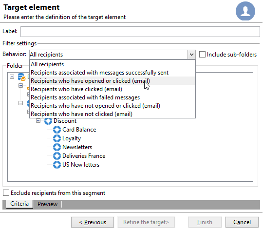

# Criar a primeira entrega {#create-a-msg}

Nesta página, aprenda a criar uma entrega única. É possível criar outros tipos de entregas para construir os seus casos de uso. Saiba mais sobre os diferentes tipos de entregas e como criá-las [nesta página](gs-message.md).

Estas são as principais etapas para criar uma entrega única:

1. **Crie uma nova entrega**.  [Leia mais](#create-the-delivery)

1. **Defina o conteúdo da entrega**. [Leia mais](#content-of-the-delivery)

1. **Selecione a população do público-alvo**. [Leia mais](#target-population)

Em seguida, você pode preparar, testar, enviar e monitorar suas mensagens com o Adobe Campaign.

>[!NOTE]
>
>As etapas descritas nesta seção pressupõem que todos os destinatários e seus perfis estejam armazenados no banco de dados, exceto no caso de entregas externas. Consulte [Selecionar destinatários externos](#selecting-external-recipients).

## Criar a entrega {#create-the-delivery}

Para criar uma entrega, siga estas etapas:

1. Navegue até a lista de entregas e clique em **[!UICONTROL Create]**.
1. Selecione o canal de entrega. Para fazer isso, selecione o modelo de entrega apropriado na lista suspensa.

   

   Um modelo integrado é fornecido para cada canal instalado: email, telefone, canais móveis (push/SMS), correspondência direta, X (Twitter) etc. Os canais disponíveis na lista dependem do contrato de licença.

   Você pode criar novos modelos de entrega para pré-configurar parâmetros específicos que atendam às suas necessidades.  [Saiba mais](../send/create-templates.md).

1. Insira um nome para a entrega no campo **[!UICONTROL Label]**.

   (opcional) Também é possível atribuir um código à entrega. O nome da entrega e seu código ficam visíveis na lista de entregas, mas não aparecem para os destinatários.

1. (opcional) Adicione uma descrição no campo **[!UICONTROL Description]**.
1. (opcional) Selecione a natureza da entrega no campo relevante. Essas informações são úteis para o rastreamento da entrega: você poderá filtrar com base nesse critério na lista de entrega ou criar consultas usando esse critério de seleção.
1. Clique em **[!UICONTROL Continue]** para exibir a janela de conteúdo da mensagem.

## Definir o conteúdo da entrega {#content-of-the-delivery}

O conteúdo da entrega está pronto para ser configurado. A definição do conteúdo da entrega é específica para cada canal. Para obter mais informações, consulte a seção dedicada:

* [Definir o conteúdo do email](../send/email.md)
* [Definir o conteúdo do SMS](../send/sms/sms-content.md)
* [Definir o conteúdo da correspondência direta](../send/direct-mail.md)
* [Definir o conteúdo da notificação por push](../send/push.md)

## Definir o público-alvo {#target-population}

Em cada entrega, é possível definir vários tipos de públicos-alvo:

* **Público-alvo principal**: perfis que recebem mensagens. [Saiba mais](#select-the-main-target)
* **Público-alvo de prova**: perfis que recebem mensagens de prova. Uma prova é uma mensagem especial que permite testar uma entrega antes de enviá-la ao público alvo principal. [Saiba mais](#select-the-proof-target)

Além disso, no contexto de uma campanha de marketing, você pode adicionar:

* **Seed addresses**: destinatários não incluídos no público-alvo da entrega, mas que a recebem. [Saiba mais](../audiences/test-profiles.md)
* **Grupos de controle**: população que não recebe a entrega; usados para monitorar o comportamento e o impacto da campanha. [Saiba mais](../../automation/campaigns/marketing-campaign-target.md#add-a-control-group).

### Selecionar os principais destinatários da entrega {#select-the-main-target}

Na maioria dos casos, o público-alvo principal é extraído do banco de dados do Adobe Campaign (modo padrão). No entanto, destinatários também podem ser armazenados em um [arquivo externo](#selecting-external-recipients).

Para selecionar os destinatários da entrega, siga as etapas abaixo:

1. No editor de entrega, selecione **[!UICONTROL To]**.
1. Se os destinatários estiverem armazenados no banco de dados, selecione a primeira opção.

   {zoomable="yes"}

1. Selecione o [target mapping](../audiences/target-mappings.md) na lista suspensa **[!UICONTROL Target mapping]**.
1. Clique no botão **[!UICONTROL Add]** para definir os filtros de restrição.

   {width="60%" align="left" zoomable="yes"}

   Selecione um tipo de filtro e clique em **[!UICONTROL Next]** para definir as condições. Você pode exibir os destinatários filtrados na guia **[!UICONTROL Preview]**. De acordo com o tipo de público-alvo, o botão **[!UICONTROL Refine target]** permite combinar vários critérios de direcionamento.

   Os seguintes tipos de público-alvo estão disponíveis:

   * **[!UICONTROL Filtering conditions]**: use esta opção para definir uma consulta e exibir o resultado. Saiba como criar uma consulta [nesta seção](../start/query-editor.md).
   * **[!UICONTROL A list of recipients]**: use essa opção para direcionar uma lista de perfis. Saiba mais sobre listas [nesta seção](../audiences/create-audiences.md).
   * **[!UICONTROL A recipient]**: use esta opção para selecionar um perfil específico no banco de dados.
   * **[!UICONTROL Recipients included in a folder]**: use esta opção para direcionar todos os perfis de uma pasta específica.
   * **[!UICONTROL Recipients of a delivery]**: use esta opção para criar o público-alvo a partir dos destinatários de uma entrega. Você deverá selecionar a entrega na lista:

     

   * **[!UICONTROL Delivery recipients belonging to a folder]**: use esta opção para criar o público-alvo a partir das entregas de destinatários incluídos em uma pasta específica.

     

     Você poderá filtrar o comportamento dos destinatários ao selecionar na lista suspensa:

     

     >[!NOTE]
     >
     >A opção **[!UICONTROL Include sub-folders]** também permite direcionar as entregas contidas nas pastas localizadas na estrutura de árvore abaixo do nó selecionado.

   * **[!UICONTROL Subscribers of an information service]**: esta opção permite selecionar um boletim informativo no qual os destinatários devem ser inscritos para receberem a entrega que está sendo criada.

     

   * **[!UICONTROL User filters]**: esta opção permite acessar os filtros pré-configurados para usar como critérios de filtragem de perfis no banco de dados. Os filtros pré-configurados são apresentados [nesta seção](../audiences/create-filters.md#default-filters).
   * A opção **[!UICONTROL Exclude recipients from this segment]** permite direcionar destinatários que não atendem aos critérios definidos. Para usar essa opção, selecione a caixa apropriada e, em seguida, aplique o direcionamento, conforme definido anteriormente, para excluir os perfis resultantes.

1. Insira um nome para esse direcionamento no campo **[!UICONTROL Label]**. Por padrão, será utilizado o rótulo do primeiro critério de direcionamento. Ao combinar critérios de filtragem, é recomendável usar um nome explícito.
1. Clique em **[!UICONTROL Finish]** para validar as opções de direcionamento.

   Os critérios de direcionamento definidos são resumidos na seção central da guia de configuração do target principal. Clique em um critério para exibir seu conteúdo (configuração e visualização). Para excluir um critério, clique na cruz localizada depois de seu rótulo.

   

### Selecionar destinatários externos {#selecting-external-recipients}

É possível enviar mensagens para perfis que não estão armazenados no banco de dados, mas que estão em um arquivo externo. Por exemplo, para enviar uma entrega para destinatários importados de um arquivo de texto, siga estas etapas:

1. Clique no link **[!UICONTROL To]** para selecionar os destinatários da sua entrega.
1. Selecione a opção **[!UICONTROL Defined in an external file]**.
1. Selecione o arquivo que contém os destinatários.
1. Ao importar os destinatários, clique no link **[!UICONTROL File format definition...]** para selecionar e configurar o arquivo externo.

   Para obter mais informações sobre importação de dados, consulte a [documentação do Campaign Classic v7](https://experienceleague.adobe.com/pt-br/docs/campaign-classic/using/getting-started/importing-and-exporting-data/generic-imports-exports/executing-import-jobs#step-2---source-file-selection){target="_blank"}.

1. Clique em **[!UICONTROL Finish]** e configure sua entrega como uma entrega padrão.

>[!CAUTION]
>
>Ao definir o conteúdo da mensagem para enviar por email a destinatários externos, não inclua o link para a mirror page: ele não pode ser gerado neste modo de entrega.

### Configurações de exclusão {#define-exclusion-settings}

Ao definir o [público-alvo de uma entrega](#target-population), utilize a guia **[!UICONTROL Exclusions]** para limitar o número de mensagens. Os parâmetros padrão são recomendados, mas você poderá adaptar as configurações dependendo das suas necessidades. No entanto, essas opções só devem ser alteradas por um usuário expert para evitar qualquer erro ou mau uso.

>[!CAUTION]
>
>Em casos de uso específicos, usuários especialistas podem alterar essas configurações, mas a Adobe recomenda manter a configuração padrão.

Você pode excluir endereços que geraram um certo número de erros consecutivos ou cuja classificação de qualidade esteja abaixo de um limite especificado nesta janela. Também é possível escolher se você autoriza ou não endereços não qualificados para os quais nenhum dado foi retornado.

Para modificar a configuração padrão, clique no link **[!UICONTROL Edit...]**.

+++ Veja as opções disponíveis

* **[!UICONTROL Exclude duplicate addresses during delivery]**: esta opção está ativa por padrão e remove endereços de email duplicados durante a entrega. A estratégia aplicada pode variar de acordo com a maneira como o Adobe Campaign é utilizado e o tipo de dados no banco de dados. É possível configurar o valor dessa opção para cada modelo de entrega.
* **[!UICONTROL Exclude recipients who no longer want to be contacted]**, ou seja, destinatários cujos endereços de email estão na lista de bloqueios (“opt out”). Esta opção deve permanecer selecionada para cumprir a ética profissional de marketing digital.
* **[!UICONTROL Exclude quarantined recipients]**: esta opção permite excluir do público-alvo alvo qualquer perfil que contenha um endereço em quarentena. É altamente recomendável manter essa opção selecionada. Saiba mais sobre o gerenciamento de quarentena [nesta seção](../send/quarantines.md).
* **[!UICONTROL Limit delivery]** para um determinado número de mensagens. Essa opção permite que você insira o número máximo de mensagens a serem enviadas. Se o público-alvo exceder o número de mensagens indicado, uma seleção aleatória será aplicada a ele. Para enviar todas as mensagens, mantenha este valor definido como “0”.
* **[!UICONTROL Keep duplicate records (same identifier)]**: esta opção permite enviar múltiplas entregas para destinatários que atendem a vários critérios de direcionamento.
+++

### Selecionar os destinatários das mensagens de prova {#select-the-proof-target}

Para entregas de email, é possível enviar provas para validar o conteúdo da mensagem. O envio de provas permite a verificação do link de opção de não participação, a mirror page e quaisquer outros links, validação da mensagem, verificação da exibição das imagens, detecção de possíveis erros, etc. Você também pode verificar seu design e renderização em diferentes dispositivos.

Uma prova é uma mensagem específica que permite testar uma mensagem antes de enviá-la ao público-alvo principal. Os destinatários da prova são responsáveis pela aprovação da mensagem: renderização, conteúdo, configurações de personalização, configuração.

Para obter mais informações sobre destinatários e envio de provas, consulte [esta seção](../send/preview-and-proof.md#send-proofs).

#### Tutorial em vídeo {#seeds-and-proofs-video}

Este vídeo mostra como adicionar seeds e provas a um email existente e o procedimento para o seu envio.

>[!VIDEO](https://video.tv.adobe.com/v/333404?quality=12)

Vídeos extras sobre procedimentos do Campaign Classic estão disponíveis [aqui](https://experienceleague.adobe.com/docs/campaign-classic-learn/tutorials/overview.html?lang=pt-BR).

## Preparar e validar a entrega {#validate-the-delivery}

Quando uma entrega for criada e configurada, você deverá validá-la antes de enviá-la para o target principal.

Para fazer isso:

1. **Analisar o delivery**: esta etapa permite preparar as mensagens para a entrega. [Saiba mais](../send/delivery-analysis.md).

1. **Enviar provas**: esta etapa permite controlar o conteúdo, os URLs, a personalização etc. [Saiba mais](../send/preview-and-proof.md).

>[!IMPORTANT]
>
>As duas etapas acima **devem ser** executadas após cada modificação realizada no conteúdo da mensagem.

## Configurar e enviar a entrega {#configuring-and-sending-the-delivery}

Acesse os parâmetros de entrega para ajustar mais configurações e definir como enviar as mensagens. Você pode definir a prioridade de entrega, configurar ondas de envio, definir as configurações de novas tentativas e testar o envio da entrega. Após a conclusão dessa configuração, será possível confirmar o envio. As mensagens são enviadas imediatamente ou com base no cronograma da entrega.

Saiba como definir as configurações de entrega [nesta página](../send/configure-and-send.md).
