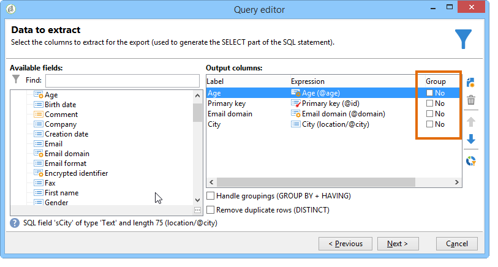

# Consultar banco de dados do Campaign

As consultas são criadas usando campos da tabela selecionada ou usando uma fórmula.

As etapas para criar um query no Adobe Campaign são as seguintes:

1. [Selecione a tabela de trabalho](#step-1---choose-a-table).
1. [Selecione os dados para extrair](#step-2---choose-data-to-extract).
1. [Definir o modo de classificação de dados](#step-3---sort-data).
1. [Definir opções de filtragem de dados](#step-4---filter-data).
1. [Configurar formatação de dados](#step-5---format-data).
1. [Visualizar os resultados da consulta](#step-6---preview-data).

Todas essas etapas estão disponíveis no [editor de consulta genérico](query-editor.md). Quando um query é criado em outro contexto, algumas etapas podem estar ausentes. Para saber mais sobre consultas, consulte também a [documentação da atividade de Query do fluxo de trabalho](../../automation/workflow/query.md).

## Etapa 1 - Escolher uma tabela {#step-1---choose-a-table}

Para consultar o banco de dados do Campaign, abra o **[editor de consulta genérico](query-editor.md)** e selecione a tabela que contém os dados que você deseja consultar na janela **[!UICONTROL Document type]**.

Se necessário, filtre os dados usando o campo de filtragem ou o botão **[!UICONTROL Filters]**.

## Etapa 2 - Escolher dados para extrair {#step-2---choose-data-to-extract}

Na tela **[!UICONTROL Data to extract]**, escolha os campos que deseja incluir na saída. Esses campos definirão as colunas exibidas nos resultados.

Por exemplo, você pode selecionar **[!UICONTROL Age]**, **[!UICONTROL Primary key]**, **[!UICONTROL Email domain]** e **[!UICONTROL City]**. O resultado será estruturado de acordo com essa seleção. Para ajustar a ordem das colunas, use as setas azuis no lado direito da janela.

Você pode modificar uma expressão adicionando uma fórmula ou aplicando um processo a uma função agregada. Para editar uma expressão, clique no campo de coluna **[!UICONTROL Expression]** e selecione **[!UICONTROL Edit expression]**.

Você pode agrupar os dados exibidos nas colunas de saída. Para fazer isso, selecione **[!UICONTROL Yes]** na coluna **[!UICONTROL Group]** da janela **[!UICONTROL Data to extract]**. Os resultados serão agregados com base no eixo de agrupamento selecionado. Para obter um exemplo de uma consulta usando agrupamento, consulte [esta seção](../../automation/workflow/query-delivery-info.md).

* A opção **[!UICONTROL Handle groupings (GROUP BY + HAVING)]** permite agrupar resultados e aplicar condições a esses grupos. Ela se aplica a todos os campos nas colunas de saída. Por exemplo, você pode usá-la para agrupar valores de uma coluna de saída e filtrar os resultados para recuperar apenas informações específicas, como destinatários com idade entre 35 e 50 anos.

  Para obter mais informações, consulte [esta seção](../../automation/workflow/query-grouping-management.md).

A opção **[!UICONTROL Remove duplicate rows (DISTINCT)]** elimina linhas idênticas da saída (desduplicar). Por exemplo, se você selecionar **Sobrenome**, **Nome** e **Email** como colunas de saída, todos os registros com os mesmos valores em todos os três campos serão considerados duplicados. Somente uma instância será mantida nos resultados, garantindo que cada contato apareça apenas uma vez.

## Etapa 3 - Classificar dados {#step-3---sort-data}

A janela **[!UICONTROL Sorting]** possibilita classificar o conteúdo da coluna. Use as setas para modificar a ordem de exibição:

* A coluna **[!UICONTROL Sorting]** oferece uma classificação simples, além de organizar o conteúdo da coluna de A a Z ou em ordem crescente.
* A opção **[!UICONTROL Descending sort]** organiza o conteúdo de Z a A e em ordem decrescente. Isso é útil para demonstrar os maiores resultados de venda: as figuras maiores são mostradas na parte superior da lista.

Neste exemplo, os dados são classificados em ordem crescente com base na idade do destinatário.

## Etapa 4 - Filtrar dados {#step-4---filter-data}

O Editor de consultas permite filtrar os dados para restringir os resultados. Os filtros disponíveis dependem da tabela que você está consultando.

Após selecionar **[!UICONTROL Filtering conditions]**, a seção **[!UICONTROL Target elements]** é aberta. Aqui, você pode definir as regras para filtrar os dados a serem coletados.

* Para criar um novo filtro, escolha os campos, operadores e valores necessários para criar a condição. Você também pode combinar várias condições, conforme explicado [nesta página](filter-conditions.md).

* Para reutilizar um filtro existente, clique no botão **[!UICONTROL Add]**, selecione **[!UICONTROL Predefined filter]** e escolha o filtro desejado.

  

Os filtros criados no **[!UICONTROL Generic query editor]** podem ser reutilizados em outros aplicativos de consulta, e o inverso também é verdadeiro. Para salvar um filtro para uso posterior, clique no ícone **[!UICONTROL Save]**.

>[!NOTE]
>
>Para saber mais sobre como criar e usar filtros, consulte [Opções de filtragem](filter-conditions.md).

Como mostrado no exemplo a seguir, para recuperar todos os destinatários falantes de inglês, selecione: &quot;recipient language **equal to** EN&quot;.

>[!NOTE]
>
>Você pode acessar diretamente uma opção digitando a seguinte fórmula no campo **Value**: **$(options:OPTION_NAME)**.

Clique na guia **[!UICONTROL Preview]** para exibir o resultado da condição de filtragem. Nesse caso, todos os destinatários que falam inglês são exibidos com sobrenome, nome e endereço de email.

Os usuários familiarizados com a linguagem SQL podem clicar em **[!UICONTROL Generate SQL query]** para exibir a query no SQL.

## Etapa 5 - Formatar dados {#step-5---format-data}

Após configurar os filtros de restrição, a janela **[!UICONTROL Data formatting]** é aberta. Nesta janela, você pode reorganizar as colunas de saída, transformar dados e ajustar as letras maiúsculas do rótulo da coluna. Também é possível aplicar fórmulas ao resultado final criando um campo calculado.

>[!NOTE]
>
>Para obter mais informações sobre os tipos de campos calculados, consulte [Criar campos calculados](filter-conditions.md#creating-calculated-fields).

Colunas não verificadas estão ocultas na janela de visualização de dados.

A coluna **[!UICONTROL Transformation]** possibilita alterar um rótulo de coluna para letras maiúsculas ou minúsculas. Selecione a coluna e clique na coluna **[!UICONTROL Transformation]**. Você pode escolher:

* **[!UICONTROL Switch to lower case]**,
* **[!UICONTROL Switch to upper case]**,
* **[!UICONTROL First letter in upper case]**.

## Etapa 6 - Pré-visualizar dados {#step-6---preview-data}

A janela **[!UICONTROL Data preview]** marca o estágio final do processo de consulta. Clique em **[!UICONTROL Start the preview of the data]** para analisar seus resultados, que podem ser exibidos em colunas ou no formato XML. Para examinar a consulta SQL subjacente, abra a guia **[!UICONTROL Generated SQL queries]**. Essa etapa permite verificar se a consulta se comporta conforme esperado antes de usá-la posteriormente.

Neste exemplo, dados são classificados em ordem crescente com base na idade do destinatário.

>[!NOTE]
>
>Como em para todas as listas disponíveis no console, por padrão, apenas as primeiras 200 linhas são exibidas na janela **[!UICONTROL Data preview]**. Para alterar isso, insira um número na caixa **[!UICONTROL Lines to display]** e clique em **[!UICONTROL Start the preview of the data]**. [Saiba mais](../config/ui-settings.md#manage-and-customize-lists)

**Tópicos relacionados**

* [Atividade de Consulta de Fluxo de Trabalho](../../automation/workflow/query.md)
* [Consultar a tabela de destinatários](../../automation/workflow/querying-recipient-table.md)
* [Condições de filtragem](filter-conditions.md)