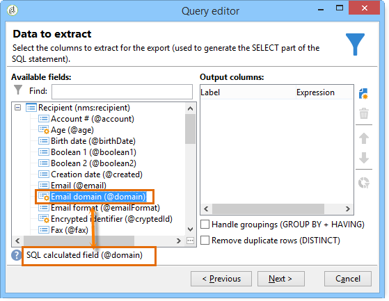

# Definir condições de filtro{#filter-conditions}

Para criar sua query, você deve selecionar as condições de filtragem no editor de query. Os recursos e casos de uso disponíveis estão detalhados nesta página.

## Escolher o operador {#choose-operator}

Nas condições de filtragem, é necessário vincular dois valores usando um operador.

Abaixo está uma lista dos operadores disponíveis:

<table> 
 <thead> 
  <tr> 
   <th> Operador  </th> 
   <th> Finalidade  </th> 
   <th> Exemplo  </th> 
  </tr> 
 </thead> 
 <tbody> 
  <tr> 
   <td> Equal to   </td> 
   <td> Retorna um resultado idêntico aos dados inseridos na segunda coluna de valor.  </td> 
   <td> <strong>Last name (@lastName) equal to 'Jones',</strong> retornará apenas destinatários cujo sobrenome seja Jones.  </td> 
  </tr> 
  <tr> 
   <td> Greater than   </td> 
   <td> Retorna um valor maior que o valor digitado.  </td> 
   <td> <strong>Age (@age) greater than 50</strong>, retornará todos os valores maiores que '50', ou seja, '51', '52' etc.  </td> 
  </tr> 
  <tr> 
   <td> Less than   </td> 
   <td> Retorna um valor menor que o valor digitado.  </td> 
   <td> <strong>Creation date (@created) before 'DaysAgo(100)'</strong>, retornará todos os destinatários criados menos de 100 dias atrás.  </td> 
  </tr> 
  <tr> 
   <td> Greater than or equal to   </td> 
   <td> Retorna todos os valores iguais ou maiores que o valor digitado.  </td> 
   <td> <strong>Age (@age) greater than or equal to '30’</strong>, retornará todos os destinatários maiores de 30 anos ou mais.  </td> 
  </tr> 
  <tr> 
   <td> Less than or equal to   </td> 
   <td> Retorna todos os valores iguais ou inferiores ao valor inserido.  </td> 
   <td> <strong>Age (@age) less than or equal to '60'</strong>, retornará todos os destinatários com 60 anos ou menos.  </td> 
  </tr> 
  <tr> 
   <td> Not equal to   </td> 
   <td> Retorna todos os valores não idênticos ao valor inserido.  </td> 
   <td> <strong>Language (@language) to equal to 'English'</strong>.  </td> 
  </tr> 
  <tr> 
   <td> Starts with   </td> 
   <td> Retorna os resultados iniciando com o valor inserido.  </td> 
   <td> <strong>Account # (@account) starts with '32010'.</strong>  </td> 
  </tr> 
  <tr> 
   <td> Does not start with   </td> 
   <td> Retorna os resultados que não começam com o valor inserido  </td> 
   <td> <strong>Account # (@account) does not start with '20'</strong>.  </td> 
  </tr> 
  <tr> 
   <td> Contains   </td> 
   <td> Retorna os resultados contendo pelo menos o valor inserido.  </td> 
   <td> <strong>Email domain (@domain) contains 'mail'</strong> retornará todos os nomes de domínio que contêm 'mail’. Assim, o domínio "gmail.com" também será retornado.  </td> 
  </tr> 
  <tr> 
   <td> Does not contain   </td> 
   <td> Retorna resultados não contendo o valor digitado.  </td> 
   <td> <strong>Email domain (@domain) does not contain 'vo'</strong>. Nesse caso, nomes de domínio que contêm 'vo' não serão retornados. O nome de domínio 'voila.fr' não aparecerá nos resultados.  </td> 
  </tr> 
  <tr> 
   <td> Like   </td> 
   <td> Like é muito semelhante ao operador Contains. Ele permite inserir um caractere curinga % no valor.  </td> 
   <td> <strong>Last name (@lastName) like 'Jon%s'</strong>. Aqui, o caractere curinga é usado como "joker" para localizar o nome "Jones", o operador esqueceu a letra ausente entre o 'n' e o 's'.  </td> 
  </tr> 
  <tr> 
   <td> Not like   </td> 
   <td> É semelhante a Like. Permite que você não recupere o valor inserido. Aqui o valor inserido também deve conter o caractere curinga %.  </td> 
   <td> <strong>Last name (@lastName) not like 'Smi%h'</strong>. Aqui, os destinatários que têm 'Smi%h' como sobrenome não serão retornados.  </td> 
  </tr> 
  <tr> 
   <td> Is empty   </td> 
   <td> Nesse caso, o resultado que estamos procurando corresponde a um valor vazio na segunda coluna de valor.  </td> 
   <td> <strong>Mobile (@mobilePhone) is empty</strong> retorna todos os destinatários que não têm número de celular.  </td> 
  </tr> 
  <tr> 
   <td> Is not empty   </td> 
   <td> Funciona de forma inversa ao operador Is empty. Não é necessário inserir dados na segunda coluna de valor.  </td> 
   <td> <strong>Email (@email) is not empty</strong>.  </td> 
  </tr> 
  <tr> 
   <td> Is included in   </td> 
   <td> Retorna resultados incluídos nos valores indicados. Esses valores devem ser separados por vírgula.  </td> 
   <td> <strong>Birth date (@birthDate) is included in '12/10/1979,12/10/1984'</strong> retornará os destinatários nascidos entre essas datas.   </td> 
  </tr> 
  <tr> 
   <td> Is not included in   </td> 
   <td> Funciona como o operador Is included in. Aqui, queremos excluir destinatários com base nos valores inseridos.  </td> 
   <td> <strong>Birth date (@birthDate) is not included in '12/10/1979,12/10/1984'</strong>. Ao contrário do exemplo anterior, os destinatários nascidos nessas datas não serão retornados.  </td> 
  </tr> 
 </tbody> 
</table>

## Usar AND, OR, EXCEPT {#using-and--or--except}

Para queries usando várias condições de filtragem, você precisa definir links entre as condições. Há três links possíveis:

* **[!UICONTROL And]** possibilita combinar duas condições de filtragem,
* **[!UICONTROL Or]** possibilita oferecer uma alternativa,
* **[!UICONTROL Except]** permite definir uma exceção.

Clique em **[!UICONTROL And]** (oferecido por padrão) e escolha na lista suspensa.

* **[!UICONTROL And]**: adiciona uma condição e permite a filtragem excessiva.
* **[!UICONTROL Or]**: adiciona uma condição e permite a filtragem excessiva.

  O exemplo a seguir permite localizar destinatários cujo domínio de email contenha &quot;orange.co.uk&quot; ou cujo código postal começa com &quot;NW&quot;.

  

* **[!UICONTROL Except]**: se você tiver dois filtros e o primeiro não retornar um valor, esse tipo de vínculo criará uma exceção.

  No exemplo a seguir, queremos retornar destinatários cujo domínio de email contenha &quot;orange.co.uk&quot;, exceto se o sobrenome do destinatário for &quot;Smith&quot;.

  

Este exemplo mostra um filtro que permite exibir: destinatários que falam espanhol, ou que são mulheres com números de celular, ou ainda destinatários sem um número de conta e cujo nome da empresa começa com a letra &quot;N&quot;.

## Priorizar condições {#prioritizing-conditions}

Esta seção explica como priorizar condições com ajuda das setas azuis na barra de ferramentas.

* A seta apontando para a direita permite adicionar um nível de parênteses ao filtro.
* A seta apontando para a esquerda permite excluir um nível de parêntese selecionado do filtro.

  

* As setas verticais permitem mover uma condição, alterando assim sua sequência de execução.

Este exemplo mostra como usar a seta para excluir um nível de parênteses. Comece a partir da seguinte condição de filtragem: **[!UICONTROL City equal to London OR gender equal to male and mobile not indicated OR account # starts with "95" and company name starts with "A"]**.

Coloque o cursor na condição de filtragem **[!UICONTROL Gender (@gender) equal to Male]** e clique na seta **[!UICONTROL Remove a parenthesis level]**.

A condição **[!UICONTROL Gender (@gender) equal to Male]** foi retirada dos parênteses. Ela foi movida para o mesmo nível da condição &quot;Cidade igual a Londres&quot;. Essas condições são vinculadas entre si (**[!UICONTROL And]**).

## Selecionar dados para extrair {#selecting-data-to-extract}

Os campos disponíveis variam de uma tabela para outra. Todos os campos são armazenados em um nó principal conhecido como **[!UICONTROL Main element]**. No exemplo a seguir, os campos disponíveis estão na tabela de destinatários. Os campos são sempre exibidos em ordem alfabética.

O detalhe do campo selecionado é visível na parte inferior da janela. Por exemplo, o campo **[!UICONTROL Email domain]** é um **[!UICONTROL Calculated SQL field]** e sua extensão é **[!UICONTROL (@domain)]**.

>[!NOTE]
>
>Use a ferramenta **[!UICONTROL Search]** para localizar um campo disponível.

Clique duas vezes em um campo disponível para adicioná-lo às colunas de saída. No final da query, cada campo selecionado cria uma coluna na janela **[!UICONTROL Data preview]**.

Campos avançados não são exibidos por padrão. Clique em **[!UICONTROL Display advanced fields]** no canto inferior direito dos campos disponíveis para exibir tudo. Clique novamente para retornar ao modo de exibição anterior.

Por exemplo, na tabela de destinatários, os campos avançados são **Boolean 1**, **[!UICONTROL Boolean 2]**, **[!UICONTROL Boolean 3]**, **[!UICONTROL Foreign key of "Folder" link]** etc.

O exemplo a seguir mostra os campos avançados da tabela de destinatários.

As várias categorias de campos:

<table> 
 <thead> 
  <tr> 
   <th> Ícone  </th> 
   <th> Descrição  </th> 
   <th> Exemplos  </th> 
  </tr> 
 </thead> 
 <tbody> 
  <tr> 
   <td>  </td> 
   <td> Campo simples  </td> 
   <td> Email, gênero, etc.  </td> 
  </tr> 
  <tr> 
   <td>  </td> 
   <td> Chave primária. Este campo SQL é uma maneira de identificar um registro em uma tabela.  </td> 
   <td> Os destinatários do identificador são chaves primárias e os identificadores são exclusivos por definição.  </td> 
  </tr> 
  <tr> 
   <td>  </td> 
   <td> Chave externa. Usado como um link para outra tabela.  </td> 
   <td> Chave externa do destinatário, chave externa de serviço etc.  </td> 
  </tr> 
  <tr> 
   <td>  </td> 
   <td> Campo calculado. Esse tipo de campo é calculado mediante solicitação usando os valores no banco de dados.  </td> 
   <td> Idade, domínio de email etc.  </td> 
  </tr> 
  <tr> 
   <td>  </td> 
   <td> Campo contendo textos longos.  </td> 
   <td> Comentário, endereço completo etc.  </td> 
  </tr> 
  <tr> 
   <td>  </td> 
   <td> Campo SQL indexado.   </td> 
   <td> Nome completo, código ISO etc.   </td> 
  </tr> 
 </tbody> 
</table>

Vincular a uma tabela e elemento de coleção:

<table> 
 <thead> 
  <tr> 
   <th> Ícone  </th> 
   <th> Descrição  </th> 
   <th> Exemplo  </th> 
  </tr> 
 </thead> 
 <tbody> 
  <tr> 
   <td>  </td> 
   <td> Vincular a uma tabela em particular. Eles coincidem com as associações de tipo 1-1. Uma ocorrência da tabela de origem pode coincidir com apenas uma ocorrência da tabela de target. Por exemplo, somente um destinatário pode ser vinculado a um país.  </td> 
   <td> Pasta, Estado, País etc.   </td> 
  </tr> 
  <tr> 
   <td>  </td> 
   <td> Elemento de coleção em uma tabela específica. Eles correspondem com associações de tipo 1-N. Uma ocorrência da tabela de origem pode coincidir com várias ocorrências da tabela de destino, mas uma ocorrência da tabela de destino pode coincidir com apenas uma ocorrência da tabela de origem. Por exemplo, um destinatário pode assinar cartas de assinatura 'n'.  </td> 
   <td> Assinaturas, listas, logs de exclusão etc.  </td> 
  </tr> 
 </tbody> 
</table>

>[!NOTE]
>
>* Use o botão **[!UICONTROL Add]** (acima da barra de ícones lateral) para adicionar uma coluna de saída na qual editaremos a expressão. Para obter mais informações sobre como editar uma expressão, consulte [esta seção](#building-expressions).
>* Exclua uma coluna de saída clicando no &#39;x&#39; vermelho (**Excluir**).
>* Altere a ordem das colunas de saída usando as setas.
>* O **[!UICONTROL Distribution of values]** é uma maneira de exibir a distribuição dos valores do campo selecionado (por exemplo, as distribuições vinculadas às cidades de destinatários, idiomas do destinatário, etc.).

## Criar campos calculados {#creating-calculated-fields}

Se necessário, adicione uma coluna durante a formatação de dados. Um campo calculado adiciona uma coluna à seção de visualização de dados. Clique em **[!UICONTROL Add a calculated field]**.

Existem quatro tipos de campos calculados:

* **[!UICONTROL Fixed string]**: permite adicionar uma string.

  

* **[!UICONTROL String with JavaScript tags]**: o valor do campo calculado combina uma string e diretivas JavaScript.

  

* **[!UICONTROL JavaScript expression]**: o valor do campo calculado é o resultado de uma avaliação de função JavaScript. O valor retornado pode ser digitado (número, data etc.).

  

* **[!UICONTROL Enumerations]**: esse tipo de campo permite usar/modificar o conteúdo de uma das colunas de saída em uma nova coluna.

  É possível usar o valor de origem de uma coluna e fornecer um valor de destino. Esse valor de destino será exibido na nova coluna de saída.

  Há um exemplo de adição do tipo de campo calculado **[!UICONTROL Enumerations]** [nesta seção](../../automation/workflow/adding-enumeration-type-calculated-field.md).

  

  O tipo de campo calculado **[!UICONTROL Enumerations]** pode incluir quatro condições:

   * **[!UICONTROL Keep the source value]** restaura o valor de origem no destino sem alterá-lo.
   * **[!UICONTROL Use the following value]** possibilita inserir um valor de destino padrão para valores de origem não definidos.
   * **[!UICONTROL Generate a warning and continue]** avisa o usuário que o valor de origem não pode ser alterado.
   * **[!UICONTROL Generate an error and reject the line]** impede que a linha seja calculada e importada.

Clique em **[!UICONTROL Detail of calculated field]** para exibir os detalhes do campo inserido.

Para remover esse campo calculado, clique na cruz **[!UICONTROL Remove the calculated field]**.

## Criar expressões {#building-expressions}

A ferramenta de edição de expressão permite calcular agregações, gerar funções ou editar uma fórmula usando uma expressão.

O exemplo a seguir mostra como executar uma contagem em uma chave primária.

Siga as etapas abaixo:

1. Clique em **[!UICONTROL Add]** na janela **[!UICONTROL Data to extract]**. Na janela **[!UICONTROL Formula type]**, selecione um tipo de fórmula para inserir a expressão.

   Há vários tipos de fórmulas disponíveis: **[!UICONTROL Field only]**, **[!UICONTROL Aggregate]**, **[!UICONTROL Expression]**.

   Selecione **[!UICONTROL Process on an aggregate function]** e **[!UICONTROL Count]**. Clique em **[!UICONTROL Next]**.

   

1. A chave primária é calculada.

   

Veja a seguir uma exibição detalhada das opções disponíveis na janela **[!UICONTROL Formula types]**:

1. **[!UICONTROL Field only]** permite retornar à janela **[!UICONTROL Field to select]**.
1. **[!UICONTROL Aggregate (Process on an aggregate function)]**. Veja alguns exemplos de uso agregado:

   * **[!UICONTROL Count]** permite executar uma contagem de chaves primárias.
   * **[!UICONTROL Sum]** permite somar todas as compras feitas por um cliente no período de um ano.
   * **[!UICONTROL Maximum value]** permite encontrar os clientes que compraram mais produtos &quot;n&quot;.
   * O **[!UICONTROL Minimum value]** permite classificar os clientes e encontrar aqueles que se subscreveram para uma oferta mais recentemente.
   * **[!UICONTROL Average]**. Essa função permite calcular a idade média dos destinatários.

     A caixa **[!UICONTROL Distinct]** permite recuperar valores exclusivos e diferentes de zero em uma coluna. Por exemplo, é possível recuperar todos os logs de rastreamento de um destinatário; eles são alterados para o valor 1, desde que sejam todos referentes ao mesmo destinatário.

1. **[!UICONTROL Expression]** abre a janela **[!UICONTROL Edit the expression]**. Isso permite detectar números de telefone com muitos numerais, provavelmente devido a erros de entrada.

   

   Para obter uma lista de todas as funções disponíveis, consulte [Lista de funções](#list-of-functions).

## Lista de funções {#list-of-functions}

Se uma fórmula do tipo **[!UICONTROL Expression]** for escolhida, você será direcionado à janela &quot;edit the expression&quot;. É possível associar várias categorias de funções aos campos disponíveis: **[!UICONTROL Aggregates]**, **[!UICONTROL String]**, **[!UICONTROL Date]**, **[!UICONTROL Numerical]**, **[!UICONTROL Currency]**, **[!UICONTROL Geomarketing]**, **[!UICONTROL Windowing function]** e **[!UICONTROL Others]**.

O editor de expressão tem esta aparência:

Ele permite selecionar campos nas tabelas do banco de dados e adicionar funções avançadas a eles. Os recursos abaixo estão disponíveis.

**Agregados**

<table> 
 <tbody> 
  <tr> 
   <td> <strong>Nome</strong>  </td> 
   <td> <strong>Descrição</strong>  </td> 
   <td> <strong>Sintaxe</strong>  </td> 
  </tr> 
  <tr> 
   <td> <strong>Avg</strong>  </td> 
   <td> Retorna a média de uma coluna do tipo número  </td> 
   <td> Avg(&lt;value&gt;) </td> 
  </tr> 
  <tr> 
   <td> <strong>Contagem</strong>  </td> 
   <td> Conta os valores não nulos de uma coluna  </td> 
   <td> Count(&lt;value&gt;) </td>  
  </tr> 
  <tr> 
   <td> <strong>CountAll</strong>  </td> 
   <td> Conta os valores retornados (todos os campos)  </td> 
   <td> CountAll()  </td> 
  </tr> 
  <tr> 
   <td> <strong>Countdistinct</strong>  </td> 
   <td> Conta os valores não nulos distintos de uma coluna  </td> 
   <td> Countdistinct(&lt;value&gt;) </td> 
  </tr> 
  <tr> 
   <td> <strong>Max</strong>  </td> 
   <td> Retorna o valor máximo de uma coluna, string ou coluna de tipo de data  </td> 
   <td> Max(&lt;value&gt;) </td>  
  </tr> 
  <tr> 
   <td> <strong>Min</strong>  </td> 
   <td> Retorna o valor mínimo de uma coluna do tipo número, string ou dados  </td> 
   <td> Min(&lt;value&gt;) </td> 
  </tr> 
  <tr> 
   <td> <strong>StdDev</strong>  </td> 
   <td> Retorna o desvio padrão de uma coluna do tipo número, string ou dados  </td> 
   <td> StdDev(&lt;value&gt;) </td> 
  </tr> 
  <tr> 
   <td> <strong>Sum</strong>  </td> 
   <td> Retorna a soma dos valores de uma coluna do tipo número, string ou dados  </td> 
   <td> Sum(&lt;value&gt;) </td> 
  </tr> 
 </tbody> 
</table>

**String**

<table> 
 <tbody> 
  <tr> 
   <td> <strong>Nome</strong>  </td> 
   <td> <strong>Descrição</strong>  </td> 
   <td> <strong>Sintaxe</strong>  </td> 
  </tr> 
  <tr> 
   <td> <strong>AllNonNull2</strong>  </td> 
   <td> Indica se todos os parâmetros são não nulos e não estão vazios  </td> 
   <td> AllNonNull2(&lt;string&gt;, &lt;string&gt;) </td> 
  </tr> 
  <tr> 
   <td> <strong>AllNonNull3</strong>  </td> 
   <td> Indica se todos os parâmetros são não nulos e não estão vazios  </td> 
   <td> AllNonNull3(&lt;string&gt;, &lt;string&gt;, &lt;string&gt;) </td> 
  </tr> 
  <tr> 
   <td> <strong>Ascii</strong>  </td> 
   <td> Retorna o valor ASCII do primeiro caractere na string.  </td> 
   <td> Ascii(&lt;string&gt;) </td> 
  </tr> 
  <tr> 
   <td> <strong>Char</strong>  </td> 
   <td> Retorna o caractere correspondente ao código ASCII 'n'  </td> 
   <td> Char(&lt;number&gt;) </td>  
  </tr> 
  <tr> 
   <td> <strong>Charindex</strong>  </td> 
   <td> Retorna a posição da string 2 na string 1.  </td> 
   <td> Charindex(&lt;string&gt;, &lt;string&gt;) </td> 
  </tr> 
  <tr> 
   <td> <strong>GetLine</strong>  </td> 
   <td> Retorna a linha enésima (de 1 a n) da string  </td> 
   <td> GetLine(&lt;string&gt;) </td> 
  </tr> 
  <tr> 
   <td> <strong>IfEquals</strong>  </td> 
   <td> Retorna o terceiro parâmetro se os dois primeiros parâmetros forem iguais. Caso contrário, retorna o último parâmetro  </td> 
   <td> IfEquals(&lt;string&gt;, &lt;string&gt;, &lt;string&gt;, &lt;string&gt;) </td> 
  </tr> 
  <tr> 
   <td> <strong>IsMemoNull</strong>  </td> 
   <td> Indica se o memorando passado como parâmetro é nulo  </td> 
   <td> IsMemoNull(&lt;memo&gt;) </td> 
  </tr> 
  <tr> 
   <td> <strong>JuxtWords</strong>  </td> 
   <td> Concatena a string transmitidas como parâmetros. Adiciona espaços entre a string, se necessário.  </td> 
   <td> JuxtWords(&lt;string&gt;, &lt;string&gt;) </td> 
  </tr> 
  <tr> 
   <td> <strong>JuxtWords3</strong>  </td> 
   <td> Concatena a string transmitidas como parâmetros. Adiciona espaços entre a string, se necessário  </td> 
   <td> JuxtWords3(&lt;string&gt;, &lt;string&gt;, &lt;string&gt;) </td>  
  </tr> 
  <tr> 
   <td> <strong>LPad</strong>  </td> 
   <td> Retorna a string concluída à esquerda  </td> 
   <td> LPad(&lt;string&gt;, &lt;number&gt;, &lt;character&gt;) </td> 
  </tr> 
  <tr> 
   <td> <strong>Left</strong>  </td> 
   <td> Retorna os primeiros n caracteres da string  </td> 
   <td> Left(&lt;string&gt;, &lt;number&gt;) </td> 
  </tr> 
  <tr> 
   <td> <strong>Length</strong>  </td> 
   <td> Retorna o comprimento da string  </td> 
   <td> Length(&lt;string&gt;) </td> 
  </tr> 
  <tr> 
   <td> <strong>Lower</strong>  </td> 
   <td> Retorna a string em minúsculas  </td> 
   <td> Lower(&lt;string&gt;) </td> 
  </tr> 
  <tr> 
   <td> <strong>Ltrim</strong>  </td> 
   <td> Remove espaços à esquerda da string  </td> 
   <td> Ltrim(&lt;string&gt;) </td> 
  </tr> 
  <tr> 
   <td> <strong>Md5Digest</strong>  </td> 
   <td> Retorna uma representação hexadecimal da chave MD5 de uma string  </td> 
   <td> Md5Digest(&lt;string&gt;) </td> 
  </tr> 
  <tr> 
   <td> <strong>MemoContains</strong>  </td> 
   <td> Especifica se o memorando contém a string aprovada como um parâmetro  </td> 
   <td> MemoContains(&lt;memo&gt;, &lt;string&gt;) </td> 
  </tr> 
  <tr> 
   <td> <strong>RPad</strong>  </td> 
   <td> Retorna a string concluída à direita  </td> 
   <td> RPad(&lt;string&gt;, &lt;number&gt;, &lt;character&gt;) </td> 
  </tr> 
  <tr> 
   <td> <strong>Right</strong>  </td> 
   <td> Retorna os últimos n caracteres da string  </td> 
   <td> Right(&lt;string&gt;)  </td> 
  </tr> 
  <tr> 
   <td> <strong>Rtrim</strong>  </td> 
   <td> Remove espaços à direita da string  </td> 
   <td> Rtrim(&lt;string&gt;)  </td> 
  </tr> 
  <tr> 
   <td> <strong>Smart</strong>  </td> 
   <td> Retorna a string com a primeira letra de cada palavra em maiúsculas  </td> 
   <td> Smart(&lt;string&gt;)  </td> 
  </tr> 
  <tr> 
   <td> <strong>Substring</strong>  </td> 
   <td> Extrai a substring iniciando no caractere n1 da cadeira de caracteres e de comprimento n2  </td> 
   <td> Substring(&lt;string&gt;, &lt;offset&gt;, &lt;length&gt;)  </td>  
  </tr> 
  <tr> 
   <td> <strong>ToString</strong>  </td> 
   <td> Converte o número em uma string  </td> 
   <td> ToString(&lt;number&gt;, &lt;number&gt;)  </td>  
  </tr> 
  <tr> 
   <td> <strong>Upper</strong>  </td> 
   <td> Retorna a string em maiúsculas  </td> 
   <td> Upper(&lt;string&gt;)  </td>  
  </tr> 
  <tr> 
   <td> <strong>VirtualLink</strong>  </td> 
   <td> Retorna a chave externa de um link passado como um parâmetro se os outros dois parâmetros forem iguais  </td> 
   <td> VirtualLink(&lt;número&gt;, &lt;número&gt;, &lt;número&gt;)  </td>  
  </tr> 
  <tr> 
   <td> <strong>VirtualLinkStr</strong>  </td> 
   <td> Retorna a chave externa (texto) de um link passado como um parâmetro se os outros dois parâmetros forem iguais  </td> 
   <td> VirtualLinkStr(&lt;string&gt;, &lt;number&gt;, &lt;number&gt;)  </td>  
  </tr> 
  <tr> 
   <td> <strong>dataLength</strong>  </td> 
   <td> Retorna o tamanho da string  </td> 
   <td> dataLength(&lt;string&gt;)  </td>  
  </tr> 
 </tbody> 
</table>

**Data**

<table> 
 <tbody> 
  <tr> 
   <td> <strong>Nome</strong>  </td> 
   <td> <strong>Descrição</strong>  </td> 
   <td> <strong>Sintaxe</strong>  </td> 
  </tr> 
  <tr> 
   <td> <strong>AddDays</strong>  </td> 
   <td> Adiciona um número de dias a uma data  </td> 
   <td> AddDays(&lt;data&gt;, &lt;número&gt;)  </td>  
  </tr> 
  <tr> 
   <td> <strong>AddHours</strong>  </td> 
   <td> Adiciona um número de horas a uma data  </td> 
   <td> AddHours(&lt;data&gt;, &lt;número&gt;)  </td>  
  </tr> 
  <tr> 
   <td> <strong>AddMinutes</strong>  </td> 
   <td> Adiciona um número de minutos a uma data  </td> 
   <td> AddMinutes(&lt;data&gt;, &lt;número&gt;)  </td>  
  </tr> 
  <tr> 
   <td> <strong>AddMonths</strong>  </td> 
   <td> Adiciona um número de meses a uma data  </td> 
   <td> AddMonths(&lt;data&gt;, &lt;número&gt;)  </td>  
  </tr> 
  <tr> 
   <td> <strong>AddSeconds</strong>  </td> 
   <td> Adiciona um número de segundos a uma data  </td> 
   <td> AddSeconds(&lt;data&gt;, &lt;número&gt;)  </td>  
  </tr> 
  <tr> 
   <td> <strong>AddYears</strong>  </td> 
   <td> Adiciona um número de anos a uma data  </td> 
   <td> AddYears(&lt;data&gt;, &lt;número&gt;)  </td>  
  </tr> 
  <tr> 
   <td> <strong>DateOnly</strong>  </td> 
   <td> Retorna somente a data (com a hora 00:00)*  </td> 
   <td> DateOnly(&lt;date&gt;)  </td>  
  </tr> 
  <tr> 
   <td> <strong>Day</strong>  </td> 
   <td> Retorna o número que representa o dia da data  </td> 
   <td> Day(&lt;data&gt;)  </td>  
  </tr> 
  <tr> 
   <td> <strong>DayOfYear</strong>  </td> 
   <td> Retorna o número do dia no ano da data  </td> 
   <td> DayOfYear(&lt;date&gt;)  </td>  
  </tr> 
  <tr> 
   <td> <strong>DaysAgo</strong>  </td> 
   <td> Retorna a data correspondente à data atual menos n dias  </td> 
   <td> DaysAgo(&lt;number&gt;)  </td>  
  </tr> 
  <tr> 
   <td> <strong>DaysAgoInt</strong>  </td> 
   <td> Retorna a data (inteiro aaaammdd) correspondente à data atual menos n dias  </td> 
   <td> DaysAgoInt(&lt;number&gt;)  </td>  
  </tr> 
  <tr> 
   <td> <strong>DaysDiff</strong>  </td> 
   <td> Número de dias entre duas datas  </td> 
   <td> DaysDiff(&lt;data final&gt;, &lt;data inicial&gt;)  </td>  
  </tr> 
  <tr> 
   <td> <strong>DaysOld</strong>  </td> 
   <td> Retorna a idade em dias de uma data.  </td> 
   <td> DaysOld(&lt;data&gt;)  </td>  
  </tr> 
  <tr> 
   <td> <strong>GetDate</strong>  </td> 
   <td> Retorna a data atual do sistema do servidor.  </td> 
   <td> GetDate()  </td> 
  </tr> 
  <tr> 
   <td> <strong>Hour</strong>  </td> 
   <td> Retorna a hora da data.  </td> 
   <td> Hour(&lt;data&gt;)  </td>  
  </tr> 
  <tr> 
   <td> <strong>HoursDiff</strong>  </td> 
   <td> Retorna o número de horas entre duas datas  </td> 
   <td> HoursDiff(&lt;end date&gt;, &lt;start date&gt;)  </td>  
  </tr> 
  <tr> 
   <td> <strong>Minute</strong>  </td> 
   <td> Retorna os minutos da data  </td> 
   <td> Minute(&lt;data&gt;)  </td>  
  </tr> 
  <tr> 
   <td> <strong>MinutesDiff</strong>  </td> 
   <td> Retorna o número de minutos entre duas datas  </td> 
   <td> MinutesDiff(&lt;data final&gt;, &lt;data inicial&gt;)  </td>  
  </tr> 
  <tr> 
   <td> <strong>Month</strong>  </td> 
   <td> Retorna o número que representa o mês da data  </td> 
   <td> Month(&lt;data&gt;)  </td>  
  </tr> 
  <tr> 
   <td> <strong>MonthsAgo</strong>  </td> 
   <td> Retorna a data correspondente à data atual menos n meses  </td> 
   <td> MonthsAgo(&lt;número&gt;)  </td>  
  </tr> 
  <tr> 
   <td> <strong>MonthsDiff</strong>  </td> 
   <td> Retorna o número de meses entre duas datas  </td> 
   <td> MonthsDiff(&lt;data final&gt;, &lt;data inicial&gt;)  </td>  
  </tr> 
  <tr> 
   <td> <strong>MonthsOld</strong>  </td> 
   <td> Retorna a idade em meses de uma data  </td> 
   <td> MonthsOld(&lt;data&gt;)  </td>  
  </tr> 
  <tr> 
   <td> <strong>Second</strong>  </td> 
   <td> Retorna os segundos da data  </td> 
   <td> Second(&lt;date&gt;)  </td>  
  </tr> 
  <tr> 
   <td> <strong>SecondsDiff</strong>  </td> 
   <td> Retorna o número de segundos entre duas datas  </td> 
   <td> SecondsDiff(&lt;data final&gt;, &lt;data inicial&gt;)  </td>  
  </tr> 
  <tr> 
   <td> <strong>SubDays</strong>  </td> 
   <td> Subtrai um número de dias a partir de uma data  </td> 
   <td> SubDays(&lt;data&gt;, &lt;número&gt;)  </td>  
  </tr> 
  <tr> 
   <td> <strong>SubHours</strong>  </td> 
   <td> Subtrai um número de horas a partir de uma data  </td> 
   <td> SubHours(&lt;data&gt;, &lt;número&gt;)  </td>  
  </tr> 
  <tr> 
   <td> <strong>SubMinutes</strong>  </td> 
   <td> Subtrai um número de minutos de uma data  </td> 
   <td> SubMinutes(&lt;data&gt;, &lt;número&gt;)  </td>  
  </tr> 
  <tr> 
   <td> <strong>SubMonths</strong>  </td> 
   <td> Subtrai um número de meses a partir de uma data  </td> 
   <td> SubMonths(&lt;data&gt;, &lt;número&gt;)  </td>  
  </tr> 
  <tr> 
   <td> <strong>SubSeconds</strong>  </td> 
   <td> Subtrai um número de segundos a partir de uma data  </td> 
   <td> SubSeconds(&lt;data&gt;, &lt;número&gt;)  </td>  
  </tr> 
  <tr> 
   <td> <strong>SubYears</strong>  </td> 
   <td> Subtrai um número de anos a partir de uma data  </td> 
   <td> SubYears(&lt;data&gt;, &lt;número&gt;)  </td>  
  </tr> 
  <tr> 
   <td> <strong>ToDate</strong>  </td> 
   <td> Converte uma data + hora em uma data  </td> 
   <td> ToDate(&lt;data + hora&gt;)  </td>  
  </tr> 
  <tr> 
   <td> <strong>ToDateTime</strong>  </td> 
   <td> Converte uma string em uma data + hora  </td> 
   <td> ToDateTime(&lt;string&gt;)  </td>  
  </tr> 
  <tr> 
   <td> <strong>TruncDate</strong>  </td> 
   <td> Arredonda uma data e hora para o segundo mais próximo  </td> 
   <td> TruncDate(@lastModified, &lt;número de segundos&gt;)  </td> 
  </tr> 
  <tr> 
   <td> <strong>TruncDateTZ</strong>  </td> 
   <td> Arredonda uma data e hora para uma determinada precisão expressa em segundos  </td> 
   <td> TruncDateTZ(&lt;data&gt;, &lt;número de segundos&gt;, &lt;fuso horário&gt;)  </td> 
  </tr> 
  <tr> 
   <td> <strong>TruncQuarter</strong>  </td> 
   <td> Arredonda uma data para o trimestre  </td> 
   <td> TruncQuarter(&lt;data&gt;)  </td>  
  </tr> 
  <tr> 
   <td> <strong>TruncTime</strong>  </td> 
   <td> Arredonda a parte de horário para cima até o próximo segundo  </td> 
   <td> TruncTim(e&lt;date&gt;, &lt;number of seconds&gt;)  </td>  
  </tr> 
  <tr> 
   <td> <strong>TruncWeek</strong>  </td> 
   <td> Arredonda uma data para a semana  </td> 
   <td> TruncWeek(&lt;data&gt;)  </td>  
  </tr> 
  <tr> 
   <td> <strong>TruncYear</strong>  </td> 
   <td> Arredonda uma data + hora para 1º de janeiro do ano  </td> 
   <td> TruncYear(&lt;date&gt;)  </td>  
  </tr> 
  <tr> 
   <td> <strong>TruncWeek</strong>  </td> 
   <td> Retorna o número que representa o dia na semana da data  </td> 
   <td> WeekDay(&lt;data&gt;)  </td>  
  </tr> 
  <tr> 
   <td> <strong>Year</strong>  </td> 
   <td> Retorna o número que representa o ano da data  </td> 
   <td> Year(&lt;data&gt;)  </td>  
  </tr> 
  <tr> 
   <td> <strong>YearAnd Month</strong>  </td> 
   <td> Retorna o número que representa o ano e o mês da data.  </td> 
   <td> YearAndMonth(&lt;data&gt;)  </td>  
  </tr> 
  <tr> 
   <td> <strong>YearsDiff</strong>  </td> 
   <td> Retorna o número de anos entre as duas datas  </td> 
   <td> YearsDiff(&lt;data final&gt;, &lt;data inicial&gt;)  </td>  
  </tr> 
  <tr> 
   <td> <strong>YearsOld</strong>  </td> 
   <td> Retorna a idade em anos de uma data  </td> 
   <td> YearsOld(&lt;date&gt;)  </td>  
  </tr> 
 </tbody> 
</table>

>[!NOTE]
>
>Observe que a função **Dateonly** considera o fuso horário do servidor e não do operador.

**Numerical**

<table> 
 <tbody> 
  <tr> 
   <td> <strong>Nome</strong>  </td> 
   <td> <strong>Descrição</strong>  </td> 
   <td> <strong>Sintaxe</strong>  </td> 
  </tr> 
  <tr> 
   <td> <strong>Abs</strong>  </td> 
   <td> Retorna o valor absoluto de um número  </td> 
   <td> Abs(&lt;número&gt;)  </td>  
  </tr> 
  <tr> 
   <td> <strong>Ceil</strong>  </td> 
   <td> Retorna o número inteiro mais baixo maior ou igual a um número  </td> 
   <td> Ceil(&lt;número&gt;)  </td>  
  </tr> 
  <tr> 
   <td> <strong>Floor</strong>  </td> 
   <td> Retorna o maior inteiro maior ou igual a um número  </td> 
   <td> Floor(&lt;number&gt;)  </td>  
  </tr> 
  <tr> 
   <td> <strong>Greatest</strong>  </td> 
   <td> Retorna o maior número de dois números  </td> 
   <td> Greatest(&lt;número 1&gt;, &lt;número 2&gt;)  </td>  
  </tr> 
  <tr> 
   <td> <strong>Least</strong>  </td> 
   <td> Retorna o menor de dois números  </td> 
   <td> Least(&lt;número 1&gt;, &lt;número 2&gt;)  </td>  
  </tr> 
  <tr> 
   <td> <strong>Mod</strong>  </td> 
   <td> Retorna o restante da divisão inteira de n1 por n2  </td> 
   <td> Mod(&lt;number 1&gt;, &lt;number 2&gt;)  </td>  
  </tr> 
  <tr> 
   <td> <strong>Percent</strong>  </td> 
   <td> Retorna a proporção de dois números expressos como uma porcentagem  </td> 
   <td> Percent(&lt;número 1&gt;, &lt;número 2&gt;)  </td>  
  </tr> 
  <tr> 
   <td> <strong>Random</strong>  </td> 
   <td> Retorna o valor aleatório  </td> 
   <td> Random()  </td> 
  </tr> 
  <tr> 
   <td> <strong>Round</strong>  </td> 
   <td> Arredonda um número para decimais n  </td> 
   <td> Round(&lt;número&gt;, &lt;número de decimais&gt;)  </td>  
  </tr> 
  <tr> 
   <td> <strong>Sign</strong>  </td> 
   <td> Retorna o sinal do número  </td> 
   <td> Sign(&lt;número&gt;)  </td>  
  </tr> 
  <tr> 
   <td> <strong>ToDouble</strong>  </td> 
   <td> Converte um inteiro em um flutuante  </td> 
   <td> ToDouble(&lt;número&gt;)  </td>  
  </tr> 
  <tr> 
   <td> <strong>ToInt64</strong>  </td> 
   <td> Converte um flutuante em um inteiro de 64 bits  </td> 
   <td> ToInt64(&lt;número&gt;)  </td>  
  </tr> 
  <tr> 
   <td> <strong>ToInteger</strong>  </td> 
   <td> Converte um flutuante em um inteiro  </td> 
   <td> ToInteger(&lt;número&gt;)  </td>  
  </tr> 
  <tr> 
   <td> <strong>Trunc</strong>  </td> 
   <td> Corta o n1 para o decimal n2  </td> 
   <td> Trunc(&lt;n1&gt;, &lt;n2&gt;)  </td>  
  </tr> 
 </tbody> 
</table>

1. Currency

<table> 
 <tbody> 
  <tr> 
   <td> <strong>Nome</strong>  </td> 
   <td> <strong>Descrição</strong>  </td> 
   <td> <strong>Sintaxe</strong>  </td> 
  </tr> 
  <tr> 
   <td> <strong>ConvertCurrency</strong>  </td> 
   <td> Converte uma quantia na moeda de origem em uma quantia na moeda de destino  </td> 
   <td> ConvertCurrency(&lt;amount&gt;, &lt;source currency&gt;, &lt;target currency&gt;, &lt;conversion date&gt;)  </td>  
  </tr> 
  <tr> 
   <td> <strong>FormatCurrency</strong>  </td> 
   <td> Formata a quantidade exibida com base nas configurações de moeda  </td> 
   <td> FormatCurrency(&lt;amount&gt;, &lt;currency&gt;)  </td>  
  </tr> 
 </tbody> 
</table>

**Geomarketing**

<table> 
 <tbody> 
  <tr> 
   <td> <strong>Nome</strong>  </td> 
   <td> <strong>Descrição</strong>  </td> 
   <td> <strong>Sintaxe</strong>  </td> 
  </tr> 
  <tr> 
   <td> <strong>Distance</strong>  </td> 
   <td> Retorna a distância entre dois pontos definidos por sua longitude e latitude, expresso em graus.  </td> 
   <td> Distance(&lt;Longitude A&gt;, &lt;Latitude A&gt;, &lt;Longitude B&gt;, &lt;Latitude B&gt;)  </td>  
  </tr> 
 </tbody> 
</table>

**Outros**

<table> 
 <tbody> 
  <tr> 
   <td> <strong>Nome</strong>  </td> 
   <td> <strong>Descrição</strong>  </td> 
   <td> <strong>Sintaxe</strong>  </td> 
  </tr> 
  <tr> 
   <td> <strong>Case</strong>  </td> 
   <td> Retorna o valor 1 se a condição for verdadeira. Caso contrário, retornará o valor 2.  </td> 
   <td> Case(When(&lt;condition&gt;, &lt;value 1&gt;), Else(&lt;value 2&gt;))  </td> 
  </tr> 
  <tr> 
   <td> <strong>ClearBit</strong>  </td> 
   <td> Exclui o Sinalizador no valor  </td> 
   <td> ClearBit(&lt;identificador&gt;, &lt;sinalizador&gt;)  </td>  
  </tr> 
  <tr> 
   <td> <strong>Coalesce</strong>  </td> 
   <td> Retorna o valor 2 se o valor 1 for zero ou nulo, caso contrário retorna o valor 1  </td> 
   <td> Coalesce(&lt;valor 1&gt;, &lt;valor 2&gt;)  </td>  
  </tr> 
  <tr> 
   <td> <strong>Decode</strong>  </td> 
   <td> Retorna o valor 3 se o valor 1 for igual ao valor 2. Caso contrário, retorna o valor 4.  </td> 
   <td> Decode(&lt;value 1&gt;, &lt;value 2&gt;, &lt;value 3&gt;, &lt;value 4&gt;)  </td>  
  </tr> 
  <tr> 
   <td> <strong>Else</strong>  </td> 
   <td> Retorna o valor 1 (só pode ser usado como parâmetro da função case)  </td> 
   <td> Else(&lt;value 1&gt;, &lt;value 2&gt;)  </td>  
  </tr> 
  <tr> 
   <td> <strong>GetEmailDomain</strong>  </td> 
   <td> Extrai o domínio de um endereço de email  </td> 
   <td> GetEmailDomain(&lt;valor&gt;)  </td>  
  </tr> 
  <tr> 
   <td> <strong>GetMirrorURL</strong>  </td> 
   <td> Recupera o URL do servidor da mirror page  </td> 
   <td> GetMirrorURL(&lt;valor&gt;)  </td>  
  </tr> 
  <tr> 
   <td> <strong>Iif</strong>  </td> 
   <td> Retorna o valor 1 se a expressão for verdadeira. Caso contrário, retorna o valor 2  </td> 
   <td> Iif(&lt;condition&gt;, &lt;value 1&gt;, &lt;value 2&gt;)  </td>  
  </tr> 
  <tr> 
   <td> <strong>IsBitSet</strong>  </td> 
   <td> Indica se o Sinalizador está no valor  </td> 
   <td> IsBitSet(&lt;identificador&gt;, &lt;sinalizador&gt;)  </td>  
  </tr> 
  <tr> 
   <td> <strong>IsEmptyString</strong>  </td> 
   <td> Retorna o valor 2 se a string 1 estiver vazia, caso contrário, retorna o valor 3.  </td> 
   <td> IsEmptyString(&lt;value 1&gt;, &lt;value 2&gt;, &lt;value 3&gt;)  </td>  
  </tr> 
  <tr> 
   <td> <strong>NoNull</strong>  </td> 
   <td> Retorna a string vazia se o argumento for NULL.  </td> 
   <td> NoNull(&lt;valor&gt;)  </td>   
  </tr> 
  <tr> 
   <td> <strong>RowId</strong>  </td> 
   <td> Retorna o número da linha.  </td> 
   <td> RowId  </td> 
  </tr> 
  <tr> 
   <td> <strong>SetBit</strong>  </td> 
   <td> Força o Sinalizador no valor.  </td> 
   <td> SetBit(&lt;identificador&gt;, &lt;sinalizador&gt;)  </td>  
  </tr> 
  <tr> 
   <td> <strong>ToBoolean</strong>  </td> 
   <td> Converte um número em um booleano  </td> 
   <td> ToBoolean(&lt;número&gt;)  </td>   
  </tr> 
  <tr> 
   <td> <strong>When</strong>  </td> 
   <td> Retorna o valor 1 se a expressão for verdadeira. Se não, ele retorna o valor 2 (só pode ser usado como parâmetro da função case)  </td> 
   <td> When(&lt;condition&gt;, &lt;value 1&gt;)  </td>  
  </tr> 
 </tbody> 
</table>

**Funções janela**

<table> 
 <tbody> 
  <tr> 
   <td> <strong>Nome</strong>  </td> 
   <td> <strong>Descrição</strong>  </td> 
   <td> <strong>Sintaxe</strong>  </td> 
  </tr> 
  <tr> 
   <td> <strong>Desc</strong>  </td> 
   <td> Aplica uma classificação decrescente  </td> 
   <td> Desc(&lt;valor 1&gt;)  </td>  
  </tr> 
  <tr> 
   <td> <strong>OrderBy</strong>  </td> 
   <td> Classifica o resultado dentro da partição  </td> 
   <td> OrderBy(&lt;valor 1&gt;)  </td>  
  </tr> 
  <tr> 
   <td> <strong>PartitionBy</strong>  </td> 
   <td> Partições do resultado de um query em uma tabela  </td> 
   <td> PartitionBy(&lt;valor 1&gt;)  </td>  
  </tr> 
  <tr> 
   <td> <strong>RowNum</strong>  </td> 
   <td> Gera um número de linha com base na partição da tabela e em uma sequência de classificação.  </td> 
   <td> RowNum(PartitionBy(&lt;value 1&gt;), OrderBy(&lt;value 1&gt;))  </td> 
  </tr> 
 </tbody> 
</table>
