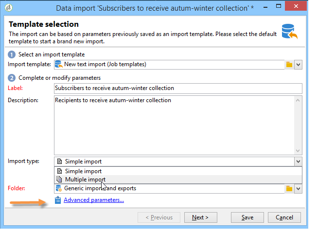
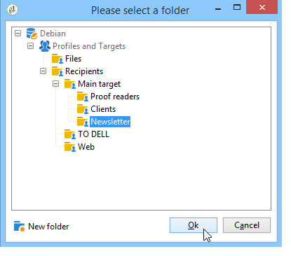

# Importar dados para o Campaign {#ootb-profiles}

O Campaign ajuda a adicionar contatos ao banco de dados. Você pode carregar um arquivo, agendar e automatizar várias atualizações de contato, coletar dados na Web ou inserir informações de perfil diretamente na tabela do destinatário.

As importações de perfil são configuradas em modelos dedicados executados por meio de fluxos de trabalho através da atividade **Importar**. Elas podem ser repetidas automaticamente de acordo com um cronograma, por exemplo, para automatizar a troca de dados entre vários sistemas de informações. Saiba mais [nesta seção](../../automation/workflow/recurring-import-workflow.md).

## Executar uma importação

O Adobe Campaign permite importar dados para o banco de dados de um ou mais arquivos no texto, no formato CSV, TAB ou XML. Esses arquivos são associados a uma tabela (principal ou vinculada) e cada campo do arquivo de origem é associado a um campo do banco de dados.

>[!NOTE]
>
>É possível importar dados sem mapeá-los com os dados do banco de dados usando a função **[!UICONTROL Import a list]**. Os dados podem ser usados exclusivamente em fluxos de trabalho por meio do objeto **[!UICONTROL Read list]**. Para obter mais informações, consulte [esta página](../../automation/workflow/read-list.md).

## Usar o assistente de importação

O assistente de importação permite configurar uma importação, definir suas opções (como transformação de dados) e iniciar a execução. É uma série de telas cujo conteúdo depende do tipo de importação (simples ou múltipla) e dos direitos do operador.

O assistente de importação é exibido após a criação de um novo trabalho de importação.

No arquivo de origem, cada linha coincide com um registro. Os dados em registros são separados por delimitadores (espaço, tabulação, caractere etc.). Isso significa que os dados são recuperados no formulário de colunas e cada coluna é associada a um campo do banco de dados.

### Etapa 1 - Escolher o modelo de importação {#step-1---choosing-the-import-template}

Ao iniciar o assistente de importação, primeiro é necessário selecionar um modelo. Como exemplo, para configurar a importação de destinatários que receberam um boletim informativo, siga as etapas abaixo:

1. Selecione a pasta **[!UICONTROL Profiles and Targets > Job > Generic imports and exports]**.
1. Clique em **New** e em **Import** para criar o modelo de importação.

   

1. Clique na seta à direita do campo **[!UICONTROL Import template]** para selecionar o modelo ou clique em **[!UICONTROL Select link]** para navegar na árvore.

   O modelo nativo é **[!UICONTROL New text import]**. Este modelo não deve ser modificado, mas você pode duplicá-lo para configurar um novo modelo dependendo de suas necessidades. Por padrão, os modelos de importação são salvos no nó **[!UICONTROL Profiles and targets > Templates > Job templates]**.

1. Insira um nome para essa importação no campo **[!UICONTROL Label]**. Você pode adicionar uma descrição.
1. Selecione o tipo de importação no campo apropriado. Há dois tipos possíveis de importação: **[!UICONTROL Simple import]** para importar apenas um arquivo e **[!UICONTROL Multiple import]** para importar vários arquivos em uma única execução.

   Para uma importação múltipla, selecione **[!UICONTROL Multiple import]** na lista suspensa **[!UICONTROL Import type]**, na primeira tela do assistente de importação.

   

1. Especifique os campos que deseja importar clicando em **[!UICONTROL Add]**.

   

   Toda vez que um arquivo é adicionado, a tela do assistente **[!UICONTROL File to import]** é exibida. Consulte a seção [Etapa 2: seleção do arquivo de origem](#step-2---source-file-selection) e siga as etapas do assistente para definir as opções de importação, como feito no caso de uma importação simples.

   >[!NOTE]
   >
   >Importações múltiplas só devem atender às necessidades específicas e não são recomendadas.

#### Etapa 2 - Seleção de arquivo de origem {#step-2---source-file-selection}

O arquivo de origem pode estar no formato de texto (txt, csv, guia, colunas fixas) ou xml.

Por padrão, **[!UICONTROL Upload file on the server]** está selecionado. Clique na pasta à direita do campo **[!UICONTROL Local file]** para navegar no disco local e selecione o arquivo a ser importado. É possível desmarcar essa opção para inserir o caminho de acesso e o nome do arquivo a ser importado se ele estiver no servidor.

Quando o arquivo tiver sido especificado, você poderá exibir os respectivos dados na seção inferior da janela clicando em **[!UICONTROL Auto-detect format]**. Essa visualização exibe as 200 primeiras linhas do arquivo de origem.

Use as opções oferecidas acima desta exibição para configurar a importação. Os parâmetros definidos por meio dessas opções são transferidos para a visualização. As seguintes opções estão disponíveis:

* **[!UICONTROL Click here to change the file format...]** permite verificar o formato do arquivo e ajustar a configuração.
* **[!UICONTROL Update on server...]** permite transferir o arquivo local para o servidor. Essa opção só estará disponível se **[!UICONTROL Upload file on the server]** estiver selecionada.
* **[!UICONTROL Download]** está disponível somente se o arquivo foi carregado no servidor.
* **[!UICONTROL Auto-detect format]** é utilizado para reinicializar o formato da fonte de dados. Essa opção permite reaplicar os formatos originais aos dados que foram formatados por meio da **[!UICONTROL Click here to change the file format...]**.
* O link **[!UICONTROL Advanced parameters]** permite filtrar os dados de origem e acessar as opções avançadas. Nessa tela, é possível importar apenas parte do arquivo. É possível definir um filtro, por exemplo, para importar usuários do tipo “Cliente potencial” ou “Cliente” de acordo com o valor da linha correspondente. Essas opções devem ser usadas somente por usuários especialistas do JavaScript.

### Alterar o formato de arquivo {#changing-the-file-format}

A opção **[!UICONTROL Click here to change the file format...]** permite formatar os dados do arquivo de origem e, em particular, especificar o separador de colunas e o tipo de dados para cada campo. Essa configuração é executada por meio da seguinte janela:

Esta etapa permite descrever como os valores dos campos de arquivo devem ser lidos. Por exemplo, as informações de uma data, a Data ou Data + Hora podem ser associadas a um formato (dd/mm/aaaa, mm/dd/aa etc.). Se não correspondem ao formato esperado, os dados de entrada são rejeitados durante a importação.

É possível ver o resultado da configuração na zona de visualização na parte inferior da janela.

Clique em **[!UICONTROL OK]** para salvar a formatação e em **[!UICONTROL Next]** para exibir a próxima etapa.

### Etapa 3 - Mapeamento de campo {#step-3---field-mapping}

Em seguida, você deve selecionar o esquema de destino e mapear os dados de cada coluna em campos no banco de dados.

* O campo **[!UICONTROL Destination schema]** permite selecionar o esquema no qual os dados serão importados. Essas informações são obrigatórias. Clique no ícone **[!UICONTROL Select link]** para selecionar um dos esquemas existentes. Clique em **[!UICONTROL Edit link]** para exibir o conteúdo da tabela selecionada.
* A tabela central mostra todos os campos definidos no arquivo de origem. Selecione os campos a serem importados para associar um arquivo de destino a eles. Esses campos podem ser mapeados manual ou automaticamente.

  Para mapear um campo manualmente, clique na caixa de seleção para selecionar o campo de origem e clique na segunda coluna para ativar a célula correspondente ao campo selecionado. Em seguida, clique no ícone **[!UICONTROL Edit expression]** para exibir todos os campos da tabela atual. Selecione o campo de destino e clique em **[!UICONTROL OK]** para validar o mapeamento.

  Para associar os campos de origem e de destino automaticamente, clique no ícone **[!UICONTROL Guess the destination fields]** à direita da lista de campos. Os campos propostos podem ser modificados se necessário.

  >[!IMPORTANT]
  >
  >O resultado desta operação deve sempre ser validado antes de você prosseguir para a próxima etapa.

* É possível aplicar uma transformação aos campos importados. Para fazer isso, clique na célula da coluna **[!UICONTROL Transformation]** relacionada ao campo e selecione a transformação a ser aplicada.

  

  >[!IMPORTANT]
  >
  >A transformação é aplicada no momento da importação. Se as restrições no campo de destino tiverem sido definidas, no entanto (no exemplo acima, no campo @lastname), essas restrições terão prioridade.

* Pode-se adicionar campos calculados usando o ícone apropriado, localizado à direita da tabela central. Os campos calculados permitem executar transformações complexas, adicionar colunas virtuais ou mesclar os dados de várias colunas. Consulte as seções a seguir para obter detalhes sobre as diversas possibilidades.

#### Campos calculados {#calculated-fields}

Os campos calculados são novas colunas adicionadas ao arquivo de origem e calculadas de outras colunas. Os campos calculados podem então ser associados a campos do banco de dados do Adobe Campaign. As operações de reconciliação, no entanto, não são possíveis em campos calculados.

Existem quatro tipos de campos calculados:

* **[!UICONTROL Fixed string]**: o valor do campo calculado é o mesmo para todas as linhas do arquivo de origem. Permite definir o valor de um campo dos registros inseridos ou atualizados. Por exemplo, você pode definir um marcador para &quot;sim&quot; para todos os registros importados.
* **[!UICONTROL String with JavaScript tags]**: o valor do campo calculado é uma string que contém comandos JavaScript.
* **[!UICONTROL JavaScript expression]**: o valor do campo calculado é o resultado da avaliação de uma função JavaScript. O valor retornado pode ser um número, uma data etc.
* **[!UICONTROL Enumeration]**: o valor do campo é atribuído de acordo com um valor contido no arquivo de origem. O editor permite especificar a coluna de origem e inserir a lista de valores de enumeração, como no exemplo a seguir:

  

  A guia **[!UICONTROL Preview]** permite visualizar o resultado da configuração definida. Aqui, a coluna **[!UICONTROL Subscription]** foi adicionada. O valor é calculado a partir do campo **Status**.

  

### Etapa 4 - Reconciliação {#step-4---reconciliation}

A etapa de reconciliação do assistente de importação permite definir o modo de reconciliação dos dados do arquivo com os dados existentes no banco de dados e definir as regras de prioridade entre os dados do arquivo e os dados do banco de dados. A janela de configuração tem esta aparência:

A seção central da tela contém uma árvore com os campos e as tabelas do banco de dados do Adobe Campaign ao qual os dados serão importados.

As opções especiais estão disponíveis para cada nó (tabela ou campo). Quando você clica no nó relacionado na lista, seus parâmetros e uma breve descrição aparecem abaixo. O comportamento definido para cada elemento é exibido na coluna **[!UICONTROL Behavior]** correspondente.

#### Tipos de operação {#types-of-operation}

Para cada tabela relacionada à importação, deve-se definir o tipo de operação. As seguintes operações estão disponíveis para o elemento principal do banco de dados:

* **[!UICONTROL Update or insertion]**: atualiza o registro se ele existir no banco de dados, caso contrário, o criará.
* **[!UICONTROL Insertion]**: insere registros no banco de dados.
* **[!UICONTROL Update]**: atualiza somente registros existentes (ignora outros registros).
* **[!UICONTROL Reconciliation only]**: procura o registro no banco de dados, mas não executa uma atualização. Por exemplo, permite associar a pasta de destinatários a ser importada de acordo com uma coluna do arquivo sem atualizar os dados nas pastas.
* **[!UICONTROL Deletion]**: permite destruir registros no banco de dados.

As seguintes opções estão disponíveis para cada campo na tabela em relação à importação:

* **[!UICONTROL Update (empty) if source value is empty]**: no caso de uma atualização, o valor no campo removerá o valor do banco de dados se o campo estiver vazio no arquivo de origem. Caso contrário, o campo do banco de dados será mantido.
* **[!UICONTROL Update only if destination is empty]**: o valor do arquivo de origem não substitui o valor no campo do banco de dados, a menos que o campo do banco de dados esteja vazio. Nesse caso, ele recebe o valor do arquivo de origem.
* **[!UICONTROL Update the field only when the record is inserted]**: durante uma operação de atualização ou inserção, somente os registros do arquivo de origem que são novos serão importados.

>[!NOTE]
>
>A definição de uma chave de reconciliação é sempre **obrigatória**, exceto no caso de inserção sem desduplicação.

#### Chaves de reconciliação {#reconciliation-keys}

Pelo menos uma chave de reconciliação deve ser preenchida para gerenciar a correção de duplicidade.

Uma chave de reconciliação é um conjunto de campos usados para identificar um registro. Por exemplo, ao importar destinatários, a chave de reconciliação pode ser o número da conta, o campo “email” ou os campos “Sobrenome, Nome, Empresa”, etc.

Nesse caso, para descobrir se uma linha de um arquivo corresponde a um destinatário existente no banco de dados, o mecanismo de importação compara os valores do arquivo com aqueles do banco de dados para todos os campos da chave. Quando os campos são específicos de um registro, uma comparação entre os dados de origem e de destino pode ser executada, garantindo a integridade dos dados após a importação. Uma segunda chave de reconciliação pode ser preenchida para a mesma tabela; ela é usada para as linhas cuja primeira chave está vazia.

Evite escolher um campo que possa ser modificado durante a importação; se isso ocorrer, o mecanismo poderá criar registros adicionais.

>[!NOTE]
>
>Para uma importação de destinatário, o identificador da pasta selecionada é adicionado implicitamente à chave.
>
>A reconciliação é executada assim apenas nessa pasta (a menos que nenhuma pasta seja selecionada).

#### Desduplicação {#deduplication}

>[!NOTE]
>
>O &quot;duplo&quot; é um item que existe duas ou mais vezes no arquivo a ser importado.
>
>O &quot;duplicado&quot; é um item que existe no arquivo a ser importado e também no banco de dados.

O campo **[!UICONTROL Management of doubles]** permite a configuração da desduplicação de dados. A desduplicação emite registros que aparecem várias vezes **no arquivo de origem** (ou nos arquivos de origem no caso de uma importação de múltiplos arquivos), ou seja, linhas para as quais os campos da chave de reconciliação são idênticos.

* O gerenciamento de duplicados no modo **[!UICONTROL Update]** (o modo padrão) não executa a desduplicação. Assim, o último registro tem prioridade (porque atualiza os dados dos registros anteriores). A contagem de duplicados não é executada nesse modo.
* O gerenciamento de duplicados no modo **[!UICONTROL Ignore]** ou **[!UICONTROL Reject entity]** exclui duplicados da importação. Nesse caso, nenhum registro é importado.
* No modo **[!UICONTROL Reject entity]**, o elemento não é importado e um erro é gerado nos logs de importação.
* No modo **[!UICONTROL Ignore]**, o elemento não é importado, mas não é mantido nenhum registro do erro. Esse modo permite otimizar o desempenho.

>[!IMPORTANT]
>
>A desduplicação é executada somente na memória. Portanto, o tamanho de uma importação com desduplicação é limitado. O limite depende de vários parâmetros (capacidade do servidor de aplicativos, atividade, número de campos na chave etc.). O tamanho máximo de uma desduplicação é da ordem de um milhão de linhas.

A desduplicação emite um registro presente no arquivo de origem e no banco de dados. Ela trata de operações de somente atualização (ou seja, **[!UICONTROL Update and insertion]** ou **[!UICONTROL Update]**). A opção **[!UICONTROL Duplicate management]** permite atualizar ou ignorar o registro se estiver tanto no arquivo de origem quanto no banco de dados. A opção **[!UICONTROL Update or insert based on origin]** pertence ao módulo opcional e não pode ser usada em um contexto padrão.

As opções **[!UICONTROL Reject]** e **[!UICONTROL Ignore]** operam como apresentado acima.

### Em caso de erro {#behavior-in-the-event-of-an-error}

A maioria das operações de transferência de dados gera vários tipos de erros (formato de linha incoerente, endereço de email inválido, etc.). Todos os erros e alertas gerados pelo mecanismo de importação são armazenados e vinculados à instância de importação.

Os detalhes dessas recusas podem ser exibidos por meio da guia **[!UICONTROL Rejects]**.

Há dois tipos de recusas (o tipo é exibido na coluna **[!UICONTROL Connector]**):

* Recusas dos erros em relação ao conector de texto que ocorrem enquanto a linha de arquivo está sendo processada (campo calculado, análise de dados etc.). Nessa situação, no caso de um erro, a linha inteira é sempre recusada.
* Rejeições do conector do banco de dados são relacionados a erros ocorridos durante a reconciliação ou escrita dos dados no banco de dados. No caso de uma importação para várias tabelas, a rejeição pode ocorrer apenas em uma parte do registro (por exemplo, para uma importação de destinatários e eventos associados, um erro pode impedir a atualização de um evento sem recusar o destinatário).

Na página de reconciliação de dados, é possível definir o campo do tipo de gerenciamento de erros desejado por campo e tabela por tabela.

* **[!UICONTROL Ignore and log a warning]**: todos os campos são importados para o banco de dados, exceto aquele que gerou um erro.
* **[!UICONTROL Reject parent element]**: a linha inteira do registro é rejeitada, não apenas o campo que causou um erro.
* **[!UICONTROL Reject all elements]**: a importação é interrompida e todos os elementos do registro são recusados.

  

A árvore na tela de rejeição de uma instância de importação indica quais campos foram rejeitados e onde ocorreram os erros.

Você pode gerar um arquivo contendo esses registros por meio do ícone **[!UICONTROL Export rejects]**:

### Etapa 5 - Etapa adicional ao importar destinatários {#step-5---additional-step-when-importing-recipients}

A próxima etapa do assistente de importação permite selecionar ou criar a pasta para a qual os dados serão importados, mapear automaticamente destinatários importados com uma lista (nova ou já existente) e assinar um serviço para os destinatários.

>[!NOTE]
>
>Esta etapa aparece ao importar destinatários somente e ao usar a tabela de destinatários padrão do Adobe Campaign (**nms:recipient**).

* Clique nos links **[!UICONTROL Edit]** para selecionar a pasta, a lista ou o serviço ao qual deseja associar ou assinar os destinatários.

   1. Importação para uma pasta

      O link **[!UICONTROL Edit...]** da seção **[!UICONTROL Import into a folder]** permite selecionar ou criar a pasta para onde os destinatários serão importados. Por padrão, se nenhuma partição for definida, os dados serão importados para a pasta padrão do operador.

      >[!NOTE]
      >
      >A pasta padrão de um operador é a primeira pasta que o operador tem acesso de gravação. Saiba mais em [Gerenciar pastas e exibições](../audiences/folders-and-views.md).

      Para selecionar a pasta de importação, clique na seta à direita do campo **[!UICONTROL Folder]** e selecione a pasta correspondente. Você também pode usar o ícone **[!UICONTROL Select link]** para exibir a árvore em uma nova janela ou criar uma nova pasta.

      

      Para criar uma nova pasta, selecione o nó no qual deseja adicionar uma pasta e clique com o botão direito do mouse. Selecione **[!UICONTROL Create a new 'Recipients' folder]**.

      

      A pasta é adicionada abaixo do nó atual. Insira o nome da nova pasta, pressione Enter para confirmar, e depois clique em **[!UICONTROL OK]**.

      

   1. Associar com uma lista

      O link **[!UICONTROL Edit...]** na seção **[!UICONTROL Add recipients to a list]** permite selecionar ou criar uma lista para onde os destinatários serão importados.

      

      Você pode criar uma nova lista para esses destinatários clicando em **[!UICONTROL Select link]** e depois em **[!UICONTROL Create]**.

      

      Você pode decidir adicionar os destinatários aos já presentes em uma lista ou para recriar a lista com os novos destinatários. Nesse caso, se a lista já continha destinatários, eles serão excluídos e substituídos pelos destinatários importados.

   1. Como assinar um serviço

      Para inscrever todos os destinatários importados para um serviço de informações, clique no link **[!UICONTROL Edit...]** da seção **[!UICONTROL Subscribe recipients to a service]** para selecionar ou criar o serviço de informações ao qual os destinatários serão inscritos. Você pode selecionar a opção **[!UICONTROL Send a confirmation message]**: o conteúdo desta mensagem é definido no modelo da entrega associado ao serviço de assinatura.

      

      É possível criar um novo serviço para esses destinatários clicando em **[!UICONTROL Select link]** e depois no ícone **[!UICONTROL Create]**. O gerenciamento dos serviços de informação é apresentado [nesta seção](../start/subscriptions.md).

* Use o campo **[!UICONTROL Origin]** para adicionar informações sobre a origem dos destinatários aos perfis. Essas informações são particularmente úteis na estrutura de uma importação múltipla.

Clique em **[!UICONTROL Next]** para validar essa etapa e exibir a seguinte.

### Etapa 6 - Iniciar a importação {#step-6---launching-the-import}

A última etapa do assistente permite iniciar a importação de dados. Para fazer isso, clique no botão **[!UICONTROL Start]**.

Você pode monitorar a execução do trabalho de importação (consulte [Monitorar a execução do fluxo de trabalho](../../automation/workflow/monitor-workflow-execution.md)).

## Exportar dados

Os trabalhos de exportação permitem acessar e extrair dados do banco de dados: contatos, clientes, listas, segmentos etc.

Por exemplo, pode ser útil usar dados de rastreamento de campanha (histórico de rastreamento etc.) em uma planilha. Os dados de output podem estar em formato txt, CSV, TAB ou XML.

O assistente de exportação permite configurar uma exportação, definir suas opções e iniciar a execução. É uma série de telas cujo conteúdo depende do tipo de exportação (simples ou múltipla) e dos direitos do operador.

O assistente de exportação é exibido após a criação de um novo trabalho de exportação.

### Etapa 1 – Escolher o modelo de exportação {#step-1---choosing-the-export-template}

Ao iniciar o assistente de exportação, primeiro é necessário selecionar um modelo. Como exemplo, para configurar a exportação de destinatários que se registraram recentemente, siga as etapas abaixo:

1. Selecione a pasta **[!UICONTROL Profiles and Targets > Job > Generic imports and exports]**.
1. Clique em **New** e em **Export** para criar o modelo de exportação.

   

1. Clique na seta à direita do campo **[!UICONTROL Export template]** para selecionar o modelo ou clique em **[!UICONTROL Select link]** para navegar na árvore.

   O modelo nativo é **[!UICONTROL New text export]**. Este modelo não deve ser modificado, mas você pode duplicá-lo para configurar um novo modelo. Por padrão, os modelos de exportação são salvos no nó **[!UICONTROL Resources > Templates > Job templates]**.

1. Insira um nome para a exportação no campo **[!UICONTROL Label]**. Você pode adicionar uma descrição.
1. Selecione o tipo de exportação. Existem dois tipos possíveis de exportação: **[!UICONTROL Simple export]** para exportar apenas um arquivo e **[!UICONTROL Multiple export]** para exportar vários arquivos em uma única execução, de um ou mais tipos de documento de origem.

### Etapa 2 - Tipo de arquivo a ser exportado {#step-2---type-of-file-to-export}

Selecione o tipo de documento a ser exportado, ou seja, o esquema dos dados para exportar.

Por padrão, quando a exportação é iniciada a partir do nó **[!UICONTROL Jobs]**, os dados são obtidos a partir da tabela de destinatários. Quando a exportação é iniciada a partir de uma lista de dados (do menu **[!UICONTROL right click > Export]**), a tabela à qual os dados pertencem é automaticamente preenchida no campo **[!UICONTROL Document type]**.

* A opção **[!UICONTROL Download the file generated on the server after the export]** está selecionada por padrão. No campo **[!UICONTROL Local file]**, preencha o nome e o caminho do arquivo que será criado ou procure o disco local clicando na pasta à direita do campo. Você pode desmarcar essa opção para inserir o caminho de acesso e o nome do arquivo de saída do servidor.

  >[!NOTE]
  >
  >Os trabalhos de importação e exportação automáticos são sempre executados no servidor.
  >
  >Para exportar apenas alguns dados, clique em **[!UICONTROL Advanced parameters]** e insira o número de linhas que devem ser exportadas no campo apropriado.

* É possível criar uma exportação diferencial para exportar apenas registros que foram modificados desde a última execução. Para fazer isso, clique no link **[!UICONTROL Advanced parameters]** e, em seguida, clique na guia **[!UICONTROL Differential export]** e, em seguida, selecione **[!UICONTROL Activate differential export]**.

  

  Você deve inserir a data da última modificação. Ele pode ser calculado ou recuperado de um campo.

### Etapa 3 - Definir o formato de saída {#step-3---defining-the-output-format}

Selecione um formato de saída para o arquivo de exportação. Os formatos a seguir podem ser usados: texto, texto fixed-column, CSV e XML.

* Para o formato **[!UICONTROL Text]**, selecione os delimitadores para separar as colunas (guias, vírgulas, ponto e vírgula ou personalizado) e as strings (aspas simples, duplas ou nenhuma).
* Para **[!UICONTROL text]** e **[!UICONTROL CSV]**, você pode selecionar a opção **[!UICONTROL Use first lines as column titles]**.
* Indique o formato de data e o formato do número. Para fazer isso, clique no botão **[!UICONTROL Edit]** do campo correspondente e utilize o editor.
* Para campos que contém os valores enumerados, é possível selecionar a opção **[!UICONTROL Export labels instead of internal values of enumerations]**. Por exemplo, o título pode ser armazenado no formulário **1=Mr.**, **2=Miss**, **3=Mrs.**. Se essa opção estiver selecionada, **Sr.**, **Srta.**, **Sra.** serão exportados.

### Etapa 4 - Seleção de dados {#step-4---data-selection}

Selecione os campos a serem exportados. Para fazer isso:

1. Clique duas vezes nos campos desejados na lista **[!UICONTROL Available fields]** para adicioná-los à seção **[!UICONTROL Output columns]**.
1. Use as setas à direita da lista para definir a ordem dos campos no arquivo de saída.

   

1. Clique no botão **[!UICONTROL Add]** para chamar as funções.

### Etapa 5 - Classificar colunas {#step-5---sorting-columns}

Selecione a ordem de classificação das colunas.

### Etapa 6 - Condições de filtro {#step-6---filter-conditions-}

Você pode adicionar condições de filtro para evitar a exportação de todos os dados. A configuração dessa filtragem é a mesma do direcionamento do recipient no assistente de delivery.

### Etapa 7 - Formatação de dados {#step-7---data-formatting}

Você pode modificar a ordem e o rótulo dos campos do arquivo de saída e aplicar transformações aos dados de origem.

* Para alterar a ordem das colunas a serem exportadas, selecione a coluna indicada e use as setas azuis à direita da tabela.
* Para alterar o rótulo de um campo, clique na célula da coluna **[!UICONTROL Label]** que corresponde ao campo que deve ser modificado e insira o novo rótulo. Pressione Enter no teclado para confirmar.
* Para aplicar uma transformação de caso ao conteúdo, selecione o respectivo campo na coluna **[!UICONTROL Transformation]**. É possível selecionar:

   * Alterar para minúsculas
   * Alterar para maiúsculas
   * Primeira letra em maiúscula

  

* Clique em **[!UICONTROL Add a calculated field]** para criar um novo campo calculado (por exemplo, uma coluna contendo o sobrenome + nome). Para obter mais informações, consulte a seção Importar dados.

Se você estiver exportando uma coleção de elementos (por exemplo, assinaturas dos destinatários, as listas às quais elas pertencem etc.), você deverá especificar o número de elementos na coleção que deseja exportar.

### Etapa 8 - Pré-visualização de dados {#step-8---data-preview}

Clique em **[!UICONTROL Start the preview of the data]** para pré-visualizar o resultado da exportação. Por padrão, as 200 primeiras linhas são exibidas. Para alterar esse valor, clique nas setas à direita do campo **[!UICONTROL Lines to display]**.

Clique nas guias localizadas na parte inferior do assistente para alternar da visualização dos resultados nas colunas para os resultados em XML. Você também pode visualizar as consultas SQL geradas.

### Etapa 9 - Iniciar a exportação {#step-9---launching-the-export}

Clique em **[!UICONTROL Start]** para iniciar a exportação de dados.

Você pode monitorar a execução do trabalho de importação.

## Coletar perfis por meio de aplicativos da Web

Use o Campaign para criar formulários web e coletar e gerenciar informações de perfil de forma fácil e eficiente. Você pode compartilhar esses formulários no seu site, o que torna mais fácil para seus contatos fornecer suas informações. Suas informações são enviadas ao Campaign para criar seu perfil ou atualizar suas informações se já estiverem presentes no banco de dados.

Saiba como criar formulários Web na [documentação do Campaign Classic v7](https://experienceleague.adobe.com/docs/campaign-classic/using/designing-content/web-forms/about-web-forms.html?lang=pt-BR){target="_blank"}.

**Tópicos relacionados**

* [Criar públicos-alvo](audiences.md)
* [Desduplicar perfis](../../automation/workflow/deduplication-merge.md)
* [Enriquecer dados de perfil](../../automation/workflow/enrich-data.md)
* Noções básicas do [modelo de dados](../dev/datamodel.md) do Campaign