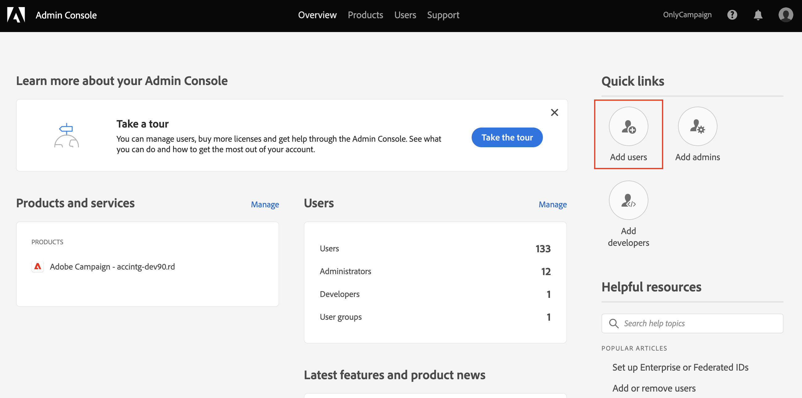

# Gerenciar permissões do usuário{#manage-permissions}

## Adicionar usuários {#add-users}

Como administrador de produto, você pode adicionar usuários e conceder acesso ao Campaign.

Para adicionar um usuário, siga as etapas abaixo:

1. No [Admin Console](https://adminconsole.adobe.com/enterprise){target="_blank"} home page, selecione **Adicionar usuários**.

   

1. Insira o endereço de email do usuário.
1. Use o sinal &quot;+&quot; para selecionar os perfis de produto ou grupos de usuários a serem atribuídos ao usuário.

   

   Os perfis de produto integrados do Campaign estão listados em [nesta seção](#ootb-productprofiles).

   Saiba como criar grupos de usuários no [nesta seção](#user-groups)

1. Clique em **Save**. O usuário é adicionado e é exibido na lista Usuários. Se você atribuir uma função de administrador ou um Perfil de produto aos usuários, eles receberão uma notificação por email. Os usuários devem seguir o link para concluir seu perfil.

Saiba mais sobre a criação de usuários no Admin Console em [esta página](https://helpx.adobe.com/ie/enterprise/using/manage-users-individually.html){target="_blank"}.

Quando novos usuários [fazer logon no Campaign](connect.md) com o Adobe ID, eles são adicionados à lista de operadores do Campaign no Console do cliente. Os operadores de campanha são armazenados no **[!UICONTROL Administration > Access management > Operators]** pasta do explorador do Campaign.

## Trabalhar com perfis de produto{#product-profiles}

Use perfis de produto para habilitar os usuários com os recursos incluídos no produto.

* Para cada produto no Admin Console, é possível criar um ou mais perfis de produto.
* Em cada perfil de produto, você atribui usuários e grupos de usuários (em sua organização).
* Quando um usuário faz logon com suas credenciais, conforme especificado no perfil do produto, ele recebe acesso aos aplicativos e serviços do produto no qual o perfil do produto se baseia.

Esses perfis de produtos correspondem aos grupos de operadores armazenados no **[!UICONTROL Administration > Access management > Operator groups]** pasta do explorador do Campaign.

No Admin Console, os perfis de produto usam a seguinte sintaxe:

campanha - `<your instance>` - nome interno do grupo de operadores

Por exemplo, para o **Operador de entrega** grupo na instância &quot;test&quot;, o perfil de produto no Admin Console é:

campaign - test - delivery

Você pode usar perfis de produto padrão ou criar novos.

### Criar um perfil de produto{#create-product-profile}

Para adicionar um novo perfil de produto ao Adobe, primeiro você deve criá-lo no Console do cliente do Campaign e, em seguida, adicioná-lo no Admin Console.

Por exemplo, para criar um perfil de produto &quot;revisores&quot;, siga as etapas abaixo.

#### Criar o grupo de operadores no Campaign{#create-op-group}

1. Conecte-se ao Campaign, abra o Explorer e navegue até **[!UICONTROL Administration > Access management > Operator groups]**.
1. Clique em **[!UICONTROL New]**e definir o nome do grupo de operadores e definir seu nome interno (&quot;revisores&quot;).
   
1. Defina as permissões associadas selecionando direitos nomeados. Os direitos nomeados são detalhados em [nesta seção](#use-named-rights)
1. Salve o novo grupo de operadores.

#### Criar o perfil de produto no Admin Console{#create-profile-in-admin-console}

1. Conecte-se à [Admin Console](https://adminconsole.adobe.com/enterprise){target="_blank"}.
1. No **Produtos e serviços** da página inicial, abra o produto Campaign.
1. Clique em **Novo perfil** e insira o nome do perfil de produto a ser criado, com a sintaxe exata correta, conforme explicado [aqui](#product-profiles). Para o nosso exemplo, inserimos: campanha - `<your-instance-name>` - revisores

   

1. Salve as alterações.

Agora você pode adicionar usuários a esse novo perfil de produto, conforme explicado em [nesta seção](#add-users).

A prática recomendada é atribuir perfis de produto a grupos de usuários. O gerenciamento de permissões por usuário não é um modelo sustentável.

### Perfis de produto e grupos de operadores padrão {#ootb-productprofiles}

O Adobe Campaign vem com **perfis de produto** que são definidos quando o Adobe habilita seu ambiente.

Esses perfis de produto correspondem ao Campaign **grupos de operadores**. Os grupos de operadores padrão e seus [direitos nomeados](#use-named-rights) estão listados abaixo:

1. **[!UICONTROL Administrator]** (administrador)

   Os operadores neste grupo têm acesso total à instância. Os administradores são usuários que podem acessar as partes mais técnicas da interface do usuário.

   Esse grupo contém os seguintes direitos nomeados:

   * **[!UICONTROL ADMINISTRATION]**: direito a executar/criar/editar/excluir qualquer objeto, como workflow, delivery, scripts, etc.

1. **[!UICONTROL Delivery operators]** (entrega)

   Os operadores nesse grupo são responsáveis pelo gerenciamento de deliveries: eles permitem o acesso aos principais recursos necessários para a criação e preparação de deliveries (tipologias de campanha, mapeamentos de delivery, templates padrão, blocos de personalização, etc.).

   Esse grupo contém os seguintes direitos nomeados:

   * **[!UICONTROL PREPARE DELIVERIES]**: Direito de criar, editar e iniciar a análise de delivery,
   * **[!UICONTROL START DELIVERIES]**: Direito de aprovar deliveries anteriormente analisados.

1. **[!UICONTROL Campaign managers]** (operação)

   Os operadores nesse grupo podem gerenciar campanhas de marketing: permite acessar os objetos vinculados às campanhas (planos, programas, workflows, orçamentos, etc.) no âmbito da estrutura de **[!UICONTROL Campaign]** (módulo opcional do Adobe Campaign).

   Esse grupo contém os seguintes direitos nomeados:

   * **[!UICONTROL INSERT FOLDERS]**: direito de inserir pastas à árvore do Adobe Campaign (se você tiver o direito de editar ramificações),
   * **[!UICONTROL WORKFLOW]**: direito de usar workflows.

   >[!NOTE]
   >
   >Esse grupo não permite que os operadores iniciem deliveries.

1. **[!UICONTROL Content contributors]** (conteúdo)

   Os usuários neste grupo podem acessar as pastas Conteúdo, no contexto do **[!UICONTROL Content management]** complementar. Este grupo não concede permissões adicionais.

1. **[!UICONTROL Access to reports]** (relatório)

   Esse grupo é reservado para operadores externos, para acessar os relatórios do delivery por meio de um [Acesso à Web](../start/campaign-ui.md#web-browser).

1. **[!UICONTROL Workflow execution]** (fluxo de trabalho)

   O grupo **[!UICONTROL Workflow execution]** permite controlar a execução e a aprovação de workflows para construção de target: o direito nomeado WORKFLOW é mapeado para os operadores deste grupo. É necessário para todas as ações em workflows, além de direitos de acesso aos arquivos de dados. Por padrão, o grupo **[!UICONTROL Workflow execution]** tem acesso somente leitura de arquivos padrão de workflows para construção de target e templates de workflow. Os operadores neste grupo também têm acesso de leitura e gravação para o arquivo de aprovação pendente.

1. **[!UICONTROL Workflow supervisors]** (workflowSupervisor)

   Os usuários neste grupo gerenciam aprovações de workflow e recebem uma notificação por email no caso de alertas relativos aos workflows da campanha.

1. **Gerenciamento local/central** (central/local)

   Os usuários neste grupo podem usar **[!UICONTROL Distributed marketing]** complementar.

1. **[!UICONTROL Offer managers]** (oferta)

   Os operadores nesse grupo podem criar e manter ofertas ao usar o complemento Interaction. [Saiba mais](../interaction/interaction-operators.md).

   Esse grupo contém os seguintes direitos nomeados:

   * **[!UICONTROL INSERT FOLDERS]**: direito de inserir pastas à árvore do Adobe Campaign (se você tiver o direito de editar ramificações),
   * **[!UICONTROL EDIT FOLDERS]**: direito de alterar as propriedades da pasta, como nome interno, rótulo, imagem associada, pedido de subpastas etc.

   As permissões atribuídas aos gerentes de oferta permitem que eles executem as seguintes tarefas:

   * Modificar ambientes **[!UICONTROL Design]**.
   * Visualizar ambientes **[!UICONTROL Live]**.
   * Configurar funções de administração (espaços e filtros predefinidos).
   * Criar e atualizar categorias.
   * Criar ofertas.
   * Configurar a qualificação para a oferta.
   * Aprovar ofertas.

   >[!NOTE]
   >
   >**Gerentes de oferta** O só pode aprovar uma oferta se nenhum revisor for especificado, ou se eles tiverem sido definidos como revisores no modelo de oferta.

   A matriz de permissões do Offer Manager por ambiente está disponível em [esta página](../interaction/interaction-operators.md#recap-of-rights-according-to-operator).

## Trabalhar com grupos de usuários{#user-groups}

Você pode usar o Admin Console para criar grupos de usuários e atribuir usuários a eles.

Um grupo de usuários é uma coleção de usuários diferentes que precisam receber um conjunto compartilhado de permissões. Saiba como criar grupos de usuários no [nesta seção](https://helpx.adobe.com/ie/enterprise/using/user-groups.html){target="_blank"}.

É possível atribuir perfis de produto a grupos de usuários. Assim, todos os usuários nesse grupo receberão o mesmo conjunto de permissões do produto.

## Direitos nomeados{#use-named-rights}

O Adobe Campaign vem com um conjunto de direitos nomeados que permitem definir as permissões atribuídas a usuários e grupos de usuários. Esses direitos podem ser editados no campo **[!UICONTROL Administration > Access management > Named rights]** pasta do explorador do Campaign.

Os direitos nomeados concedem permissões a:

* Executar operações Por exemplo, a variável **Analisar** no Editor de entrega é ativado para membros da **Operador de Entrega** grupo que tem o **Preparar entrega** Nomeado à direita

* O acesso a pastas Associação de grupos de operadores pode conceder ou restringir direitos de acesso a pastas, alterando as configurações de segurança nas pastas. [Saiba mais](folder-permissions.md#restrict-access-to-a-folder).

   Por exemplo, pode afetar: **Acesso de gravação** para criar novas entidades (como deliveries, perfis etc.), **Acesso de leitura** para usar entidades, **Excluir acesso** para excluir entidades.

Os direitos nomeados padrão no Adobe Campaign são:

* **[!UICONTROL ADMINISTRATION]**: operadores com o direito **[!UICONTROL ADMINISTRATION]** têm acesso total na instância. Os usuários administradores podem executar/criar/editar/excluir qualquer objeto, como workflow, delivery, scripts etc.

* **[!UICONTROL APPROVAL ADMINISTRATION]**: é possível definir várias etapas de aprovação em workflows e deliveries para garantir que o estado atual tenha sido aprovado por um operador ou grupo atribuído. Os usuários com o direito **[!UICONTROL APPROVAL ADMINISTRATION]** podem definir etapas de aprovação e também atribuir um operador ou grupo de operadores que devem aprovar essas etapas.

* **[!UICONTROL CENTRAL]**: direito de gerenciamento central (marketing distribuído).

* **[!UICONTROL DELETE FOLDER]**: direito de excluir pastas. Com esse direito, os usuários podem excluir pastas da visualização do explorador.

* **[!UICONTROL EDIT FOLDERS]**: direito de alterar as propriedades da pasta, como nome interno, rótulo, imagem associada, pedido de subpastas etc.

* **[!UICONTROL EXPORT]**: os usuários podem exportar dados de suas instâncias do Adobe Campaign para um arquivo no servidor ou computador local usando a atividade de workflow **[!UICONTROL EXPORT]**.

* **[!UICONTROL FILES ACCESS]**: direito de ler e gravar o acesso de arquivos por meio de um script que pode ser gravado na atividade de workflow **[!UICONTROL JavaScript]** para arquivos de leitura/gravação em um servidor.

* **[!UICONTROL IMPORT]**: direito de importação de dados genéricos. **[!UICONTROL IMPORT]** permite importar dados para qualquer outra tabela, enquanto o direito **[!UICONTROL RECIPIENT IMPORT]** permite importar somente para a tabela do recipient.

* **[!UICONTROL INSERT FOLDERS]**: direito de inserir pastas. Os usuários com o direito **[!UICONTROL INSERT FOLDERS]** podem criar novas pastas na árvore de pastas na visualização do explorador.

* **[!UICONTROL LOCAL]**: direito para gerenciamento local (marketing distribuído).

* **[!UICONTROL MERGE]**: direito de unir os registros selecionados em um. Se houver recipients duplicados, o direito **[!UICONTROL MERGE]** permitirá que o usuário selecione os duplicados e os mescle em um recipient primário.

* **[!UICONTROL PREPARE DELIVERIES]**: direito de criar, editar e salvar um delivery. Os usuários com o direito **[!UICONTROL PREPARE DELIVERIES]** também podem iniciar o processo de análise do delivery.

* **[!UICONTROL PRIVACY DATA RIGHT]**: direito de coletar e excluir dados de privacidade. [Saiba mais](privacy.md).

* **[!UICONTROL PROGRAM EXECUTION]**: direito de executar comandos em várias linguagens de programação.

* **[!UICONTROL RECIPIENT IMPORT]**: direito de importar recipients. Os usuários com o direito **[!UICONTROL RECIPIENT IMPORT]** podem importar um arquivo local para a tabela do recipient.

* **[!UICONTROL SQL SCRIPT EXECUTION]** Direito de executar qualquer comando SQL diretamente no banco de dados.

* **[!UICONTROL START DELIVERIES]**: Direito de aprovar deliveries anteriormente analisados. Após a análise, o delivery pausará em várias etapas de aprovação e precisará ser aprovado para retomar. Os usuários com o direito **[!UICONTROL START DELIVERIES]** podem aprovar deliveries.

* **[!UICONTROL USE SQL DATA MANAGEMENT ACTIVITY]**: direito de escrever seus próprios scripts SQL usando a atividade de gerenciamento de dados SQL, para criar e preencher tabelas de trabalho. [Saiba mais](../../automation/workflow/sql-data-management.md).

* **[!UICONTROL WORKFLOW]**: esse direito nomeado é específico para workflows: permite criar, iniciar e parar workflows. Os direitos de leitura no arquivo de workflow são necessários para que o direito nomeado seja aplicável. Para workflows para construção do target, a leitura no **[!UICONTROL Profiles and Targets]** é necessária.

* **[!UICONTROL WEBAPP]**: direito de usar aplicações web.

>[!NOTE]
>
>Essa lista pode variar dependendo dos complementos instalados no ambiente.

## Recursos adicionais{#additional-res}

* [Gerenciar permissões para workflows](../../automation/workflow/managing-rights.md)
* [Gerenciar permissões para marketing distribuído](../../automation/distributed-marketing/about-distributed-marketing.md#operators)
* [Gerenciar permissões do módulo de interação](../interaction/interaction-operators.md)
* [Filtrar o acesso a esquemas](../dev/filter-schema.md)
* [Restringir visualização de IP](../dev/restrict-pi-view.md)
