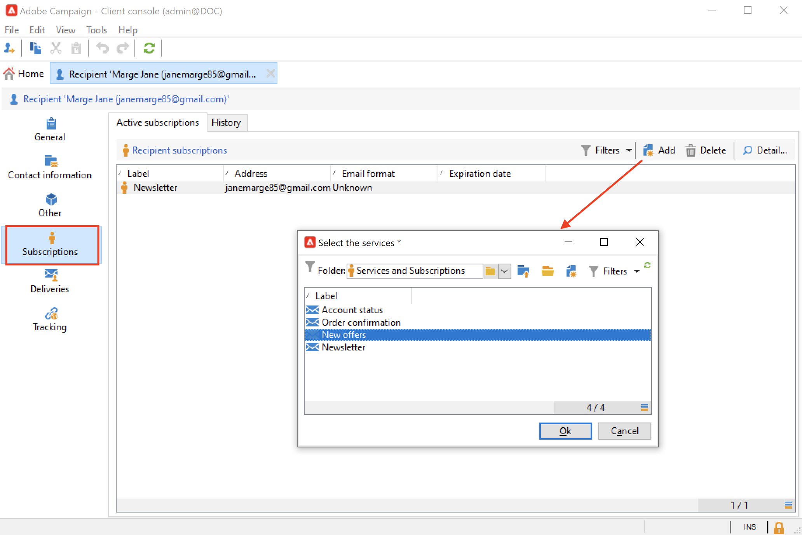
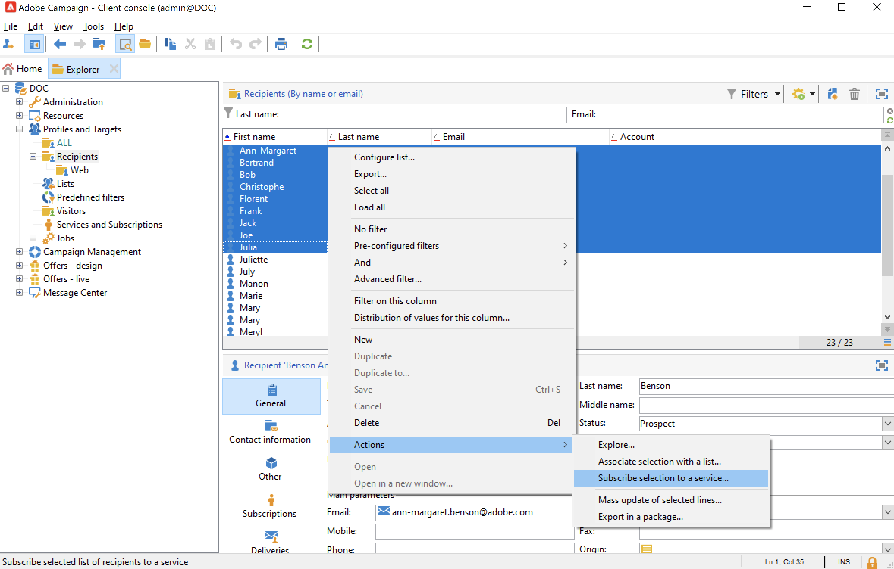
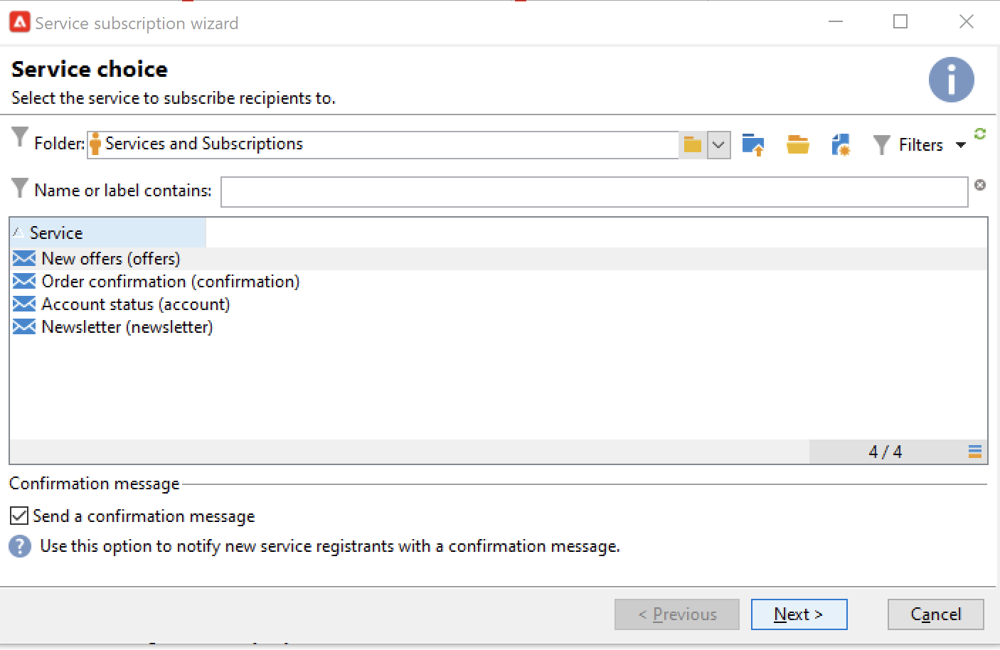
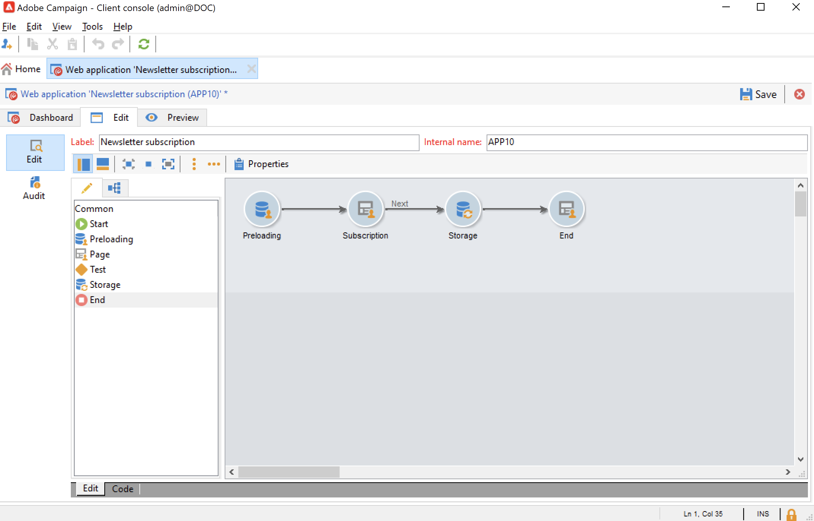
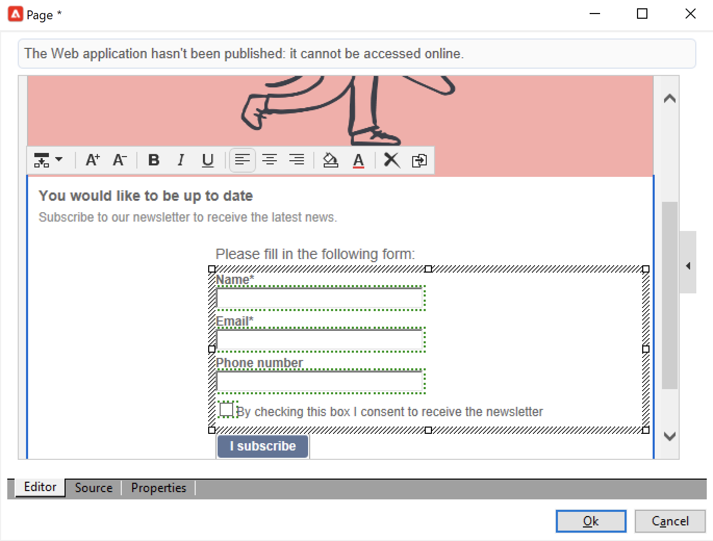
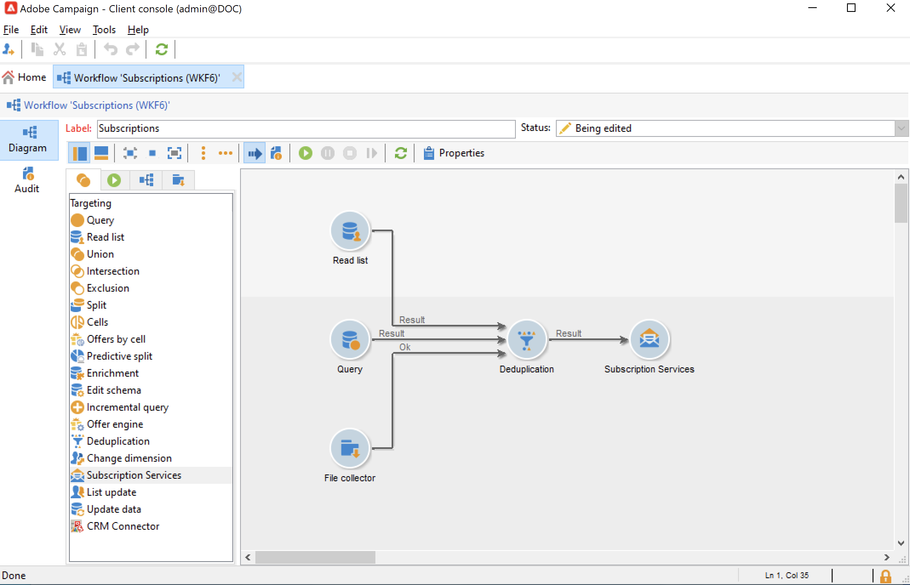

# Gerenciar assinaturas e cancelamentos de assinaturas {#optin-optout}

Use o Adobe Campaign para criar e monitorar seus serviços de informações, como boletins informativos, e gerenciar as assinaturas/cancelamentos de assinaturas desses serviços. Vários serviços podem ser definidos em paralelo, por exemplo: boletins informativos especializados para determinadas categorias de produtos, temas ou áreas de um site, subscrições a vários tipos de mensagens de alerta e notificações em tempo real.

Saiba como criar um serviço de informações, enviar informativo e gerenciar a aceitação e a recusa na [documentação do Campaign Classic v7](https://experienceleague.adobe.com/docs/campaign-classic/using/sending-messages/subscriptions-and-referrals/managing-subscriptions.html?lang=pt-BR){target="_blank"}

Para assinar (aceitar) um perfil para um serviço, as opções disponíveis são:

* Adicionar manualmente o serviço ao perfil do destinatário: para fazer isso, a partir da guia **[!UICONTROL Subscriptions]** do perfil, clique em **[!UICONTROL Add]** e selecione o serviço de informação desejado.

  

  Saiba mais na [documentação do Campaign Classic v7](https://experienceleague.adobe.com/docs/campaign-classic/using/getting-started/profile-management/editing-a-profile.html?lang=pt-BR#deliveries-tab){target="_blank"}

* Subscrever automaticamente um conjunto de recipients ao serviço. A lista de recipients pode vir de uma operação de filtragem, grupo, pasta, importação ou seleção manual direta. Para inscrever esses destinatários, selecione os perfis e clique com o botão direito do mouse. Selecione **[!UICONTROL Actions > Subscribe selection to a service...]**.

  

  Selecione o serviço desejado e inicie a operação.

  

  Saiba mais na [documentação do Campaign Classic v7](https://experienceleague.adobe.com/docs/campaign-classic/using/getting-started/profile-management/editing-a-profile.html?lang=pt-BR#deliveries-tab){target="_blank"}

* Importar destinatários e inscrevê-los automaticamente em um serviço de informação. Para fazer isso, selecione o serviço na última etapa do assistente de importação.

  Saiba mais na [documentação do Campaign Classic v7](https://experienceleague.adobe.com/docs/campaign-classic/using/getting-started/importing-and-exporting-data/generic-imports-exports/executing-import-jobs.html?lang=pt-BR#step-5---additional-step-when-importing-recipients){target="_blank"}.

* Usar um formulário da Web para que os destinatários possam subscrever-se a um serviço.

  

  O Campaign vem com um formulário web padrão para gerenciar a aceitação. Você pode personalizar e mapear os dados do perfil.

  

  Saiba mais na [documentação do Campaign Classic v7](https://experienceleague.adobe.com/docs/campaign-classic/using/designing-content/web-forms/use-cases--web-forms.html?lang=pt-BR#create-a-subscription--form-with-double-opt-in){target="_blank"}.

* Crie um fluxo de trabalho de direcionamento e use uma atividade **[!UICONTROL Subscription service]**.

  

  Saiba mais [nesta página](https://experienceleague.adobe.com/docs/campaign/automation/workflows/wf-activities/targeting-activities/subscription-services.html?lang=pt-BR){target="_blank"}.

Para cancelar a subscrição (recusa) de um perfil de um serviço, as opções disponíveis são:

**Cancelamento de assinatura manual**

* Link de cancelamento de subscrição ou formulário web personalizado
* Exclusão manual de um serviço de informação
* Exclusão manual de recipients de um serviço de assinatura específico

**Cancelamento de assinatura automático**

* Especifique um limite de duração do serviço de informação: a subscrição dos recipients será cancelada automaticamente quando o período de validade expirar. Este período é especificado na guia Edit das propriedades do serviço. Ele é expresso em dias.
* Configure um workflow de cancelamento de subscrição para uma população.

Saiba mais na [documentação do Campaign Classic v7](https://experienceleague.adobe.com/docs/campaign-classic/using/sending-messages/subscriptions-and-referrals/managing-subscriptions.html?lang=pt-BR#unsubscribing-a-recipient-from-a-service){target="_blank"}.

>[!CAUTION]
>
>No contexto de uma [implantação corporativa (FFDA)](../architecture/enterprise-deployment.md), as assinaturas e os cancelamentos de assinaturas são **processos assíncronos**. As solicitações de aceitação e recusa são processadas a cada hora. [Saiba mais](../architecture/new-apis.md#sub-apis)

<!--
You can also enable your delivery recipients to forward messages to a friend. To do this, insert the relevant links into your delivery. You may then track this sharing process as well as the number of visits to the concerned pages.

For more on this capability, refer to [Campaign Classic v7 documentation](https://experienceleague.adobe.com/docs/campaign-classic/using/sending-messages/subscriptions-and-referrals/viral-and-social-marketing.html?lang=pt-BR#viral-marketing--forward-to-a-friend){target="_blank"}
-->
